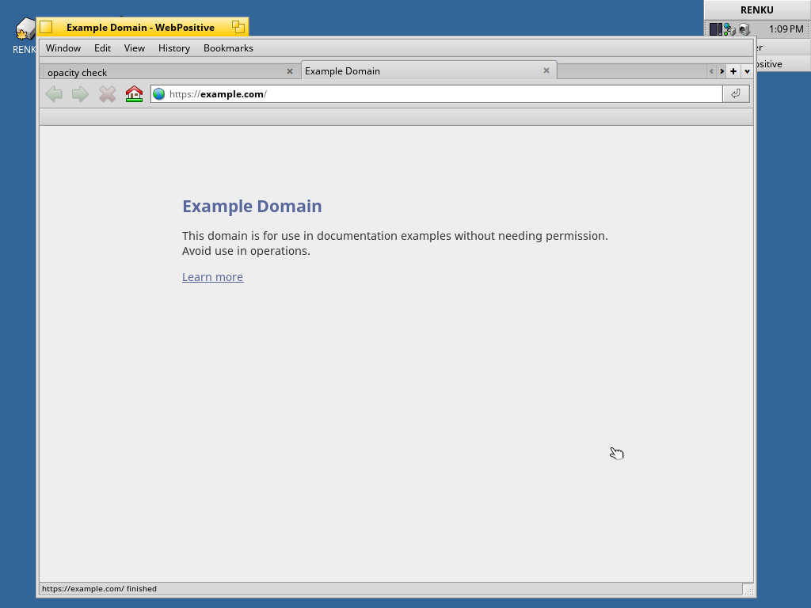

# AGENTS.md -- WebPositive for RENKU arm64

Working notes for the port: what was changed, what broke, how each thing was
measured, and what is still open. English only; the READMEs are the short
end-user documents and exist in both languages.

The port is HaikuWebKit 1.10.0 and WebPositive, cross-compiled for Haiku arm64
and installed into the RENKU arm64 image (`~/Workspace/renku-arm64`), which
runs under QEMU/hvf on Apple Silicon. The arm64 HaikuPorts repository is a
35-package bootstrap set with no WebKit, no browser and none of the image and
network libraries WebKit needs, so everything here is cross-built in the
`haiku-builder` container with the toolchain and sysroot the RENKU arm64 build
already provides.

Read the `Open` section first: it is the list of what is still wrong, and
several entries carry a correction to something written earlier in this file.

## What had to change for arm64

HaikuWebKit's Haiku-specific code is architecture-neutral; the port itself
is small. `haikuwebkit-1.10.0-arm64.patch` carries all of it:

| File | Change |
|---|---|
| `JavaScriptCore/runtime/MachineContext.h` | Haiku arm64 register mapping. Haiku's `mcontext_t` is `struct vregs { x[30], lr, sp, elr, spsr, ... }`, so the stack pointer is `sp`, the frame pointer `x[29]`, the program counter `elr` (not `pc`), and the LLInt/argument/wasm registers `x[4]`, `x[1]`, `x[19]`. Without this the file hits `#error Unknown Architecture`. |
| `JavaScriptCore/assembler/ARM64Assembler.h` | `cacheFlush()` for Haiku: the Linux path, `__builtin___clear_cache` page by page. On AArch64 that is user-space `dc cvau`/`ic ivau`, nothing OS-specific. |
| `JavaScriptCore/offlineasm/arm64.rb` | The LLInt assembler emits `globaladdr` with ELF GOT relocations (`:got:`/`:got_lo12:`) for Haiku as it does for Linux. It previously fell through to `#error Missing globaladdr implementation`. |
| `cmake/OptionsHaiku.cmake` | OpenGL ES is only required when WebGL is on (there is no Mesa for arm64). Adds `HAIKU_SYSTEM_DIR` so the private-header paths (`/system/develop/headers/private/...`) can point into a cross sysroot. |
| `WebCore/CMakeLists.txt`, `WebKitLegacy/PlatformHaiku.cmake` | Link `OpenGL::GLES` only if it was found; drop `GL` from WebKitLegacy's libraries (nothing in the Haiku code uses it). |
| `WebCore/PlatformDisplay.cpp`, `egl/GLContext.h` | `EGL_NO_X11` before the EGL headers on Haiku (same as the HaikuPorts clang patch). The Khronos EGL/KHR headers in `egl-headers/` satisfy the includes; no EGL library is linked. |
| `WebCore/PlatformHaiku.cmake` | WebCore at `-O2` instead of `-O3` with gcc. Its unified sources took over 2 GB per compiler at `-O3`, more than a 7 GB container can give three compilers at once. |

JavaScript started on the ARM64 LLInt interpreter, and the JIT is on now:
`ENABLE_JIT=ON`, `ENABLE_DFG_JIT=ON`, `ENABLE_C_LOOP=OFF`. FTL (B3) and
WebAssembly are still off. Turning the JIT on needed `OS(HAIKU)` added to the
ARM64 `ENABLE_DFG_JIT` condition in `WTF/wtf/PlatformEnable.h`. The shipped
`libJavaScriptCore.so.18.7.4` carries 3,521 `JSC::DFG` symbols.

## Dependencies

`build-webkit-deps-arm64.sh` cross-builds, into the sysroot and into a
staging tree for packaging:

libexecinfo 1.1 (FreeBSD, with the HaikuPorts patch), libpng 1.6.50,
libjpeg-turbo 3.1.1, libwebp 1.5.0, libxml2 2.13.8, libxslt 1.1.43,
libpsl 0.21.5 (ICU runtime, built-in list), curl 8.19.0 against the
sysroot's OpenSSL 3.5.4 (the bootstrap curl has no TLS, and WebCore's
network layer is curl), brotli 1.1.0, woff2 1.0.2, lcms2 2.16.

dav1d 1.4.3 and libavif 1.1.1 came later, decode only -- see the AVIF
section. ICU, zlib, SQLite and OpenSSL were already in the sysroot.

Two sysroot details that cost time: the bootstrap packages' `.pc` files
carry `prefix=/packages/<name>/.self`, which gcc ignores but CMake copies
into an imported target and then refuses to generate; the script rewrites
them. And `--with-openssl=<dir>` in curl wants `<dir>/include`, which
Haiku's layout has not got -- let pkg-config find it instead.

## Building

All inside the `haiku-builder` container, in order:

```sh
build-webkit-deps-arm64.sh                 # third-party libraries -> sysroot
# extract haikuwebkit-1.10.0.tar.gz to /root/wk/haikuwebkit, then
patch -p2 < haikuwebkit-1.10.0-arm64.patch  # from inside that directory
build-haikuwebkit-arm64.sh                 # cmake + ninja + DESTDIR install
package-haikuwebkit-arm64.sh               # -> haikuwebkit{,_devel}-1.10.0-3-arm64.hpkg
build-webpositive-image-arm64.sh           # jam WebPositive, new ISO
```

`haiku-arm64.toolchain.cmake` is the CMake toolchain file for all of it.

The packages use the version `1.10.0-3`, following the tree's x86_64
repository list, so that, listed in `build/jam/repositories/HaikuPorts/arm64` and
dropped into the download directory, jam's `webkit` build feature finds
them and `src/apps/webpositive` builds unchanged. The runtime package also
carries the third-party libraries above, with `provides`/`requires`
derived from the shipped sonames and `DT_NEEDED` entries.

## Build environment notes

The container is an x86_64 Ubuntu image emulated on Apple Silicon, and it
is shared with a Chromium arm64 port build. WebCore's unified sources need
1-2 GB of RAM per compiler; two builds at `-j4` each tipped the 7.6 GB
container into OOM kills (`Killed signal terminated program cc1plus`, or a
ninja that simply vanishes). Running WebKit at `-j3` and the other build at
`-j2` was the working split. Two ninja instances on the same build
directory can happen easily when the previous one is still finishing under
`-k 0`; kill by PID, never `pkill -f ninja`.

## Result

Verified in QEMU (hvf, `run.sh renku-arm64-webpositive.iso`, plain `-M virt`):

- WebPositive appears in Deskbar's Applications menu and starts.
- `http://info.cern.ch/...` renders text, links and layout; `https://www.haiku-os.org/docs/welcome/`
  renders with images, CSS and web fonts, and `https://www.haiku-os.org/` too.
- The image also carries `ca_root_certificates` (zlib-recompressed, see below).

Screenshots are in `screenshots/`. The ISO is `~/Workspace/renku-arm64/renku-arm64-webpositive.iso`;
it was written under a new name because a running QEMU held a write lock on
`renku-arm64.iso`. Promote it by renaming when convenient.

## Open

- ~~**Clock starts at 1 January 1970.**~~ Fixed. The PL031 RTC driver is in the
  patch set (`haiku-arm64-pl031-rtc.patch`); a booted image reports the correct
  date, so TLS handshakes no longer need `date -s` first.
- ~~**zstd-compressed packages never activate.**~~ Fixed. packagefs is built
  with zstd now: `webkit/packages` carries `zstd`, `zstd_devel` and
  `zstd_source` for arm64, cross-built by `package-zstd-arm64.sh`, and
  `build/jam/BuildFeatures` turns the feature on from `zstd_devel`. Verified on
  a booted image whose `ca_root_certificates` hpkg is still zstd-compressed
  (bytes 18-19 = `0002`): `/system/data/ssl/CARootCertificates.pem` is there.
  The zlib re-cut the image script used to do is gone.
- ~~**`example.com` renders its text invisibly.**~~ Fixed, and it was never
  about fonts. Everything with CSS `opacity` below 1 was invisible, because
  the app_server's `BoundingBoxCallbacks::DrawStringLocations` was an empty
  `// TODO` and WebKit draws all its text through the call it measures.
  `haiku-arm64-layer-text-bbox.patch`, and the section below.
- ~~**JavaScript runs on the LLInt interpreter only.**~~ Out of date. The build
  has `ENABLE_JIT=ON` and `ENABLE_DFG_JIT=ON`; the shipped
  `libJavaScriptCore.so.18.7.4` carries 3,521 `JSC::DFG` symbols. FTL (B3) is
  still off -- the largest and least-exercised tier on a new OS -- and so is
  WebAssembly.
- ~~**`ServerFont::GetBoundingBoxes` returns a garbage `left`.**~~ Found and
  fixed. `BoundingBoxCallbacks::SetFontShear` was setting the draw state's
  font to a shear of 0 degrees, and `EmbeddedTransformation` turns that into
  `tan(pi/2)` in the transform. Same patch as the opacity fix; the section
  below has the measurements.
- ~~**sshd is restarted in a loop in the guest.**~~ Fixed, and it was never
  about sshd. `device_tree_module.cpp` has `#define TRACE_DEVICE_TREE` on
  unconditionally upstream, and on a platform that hands the kernel ACPI rather
  than a device tree -- QEMU's `virt`, which is what this port is developed on
  -- `gFDT` is NULL, `device_tree_init` returns without doing anything, and the
  device manager cycles the module over and over. Three lines per cycle, more
  than a thousand lines a boot. Commenting that define out takes a boot's
  syslog from 3,382 lines plus a rotated 3,740 down to **508 with no rotation**,
  and the `Bind to port 22` failures from 1,457-2,030 down to **zero**: sshd
  logs `Server listening on :: port 22` once and that is all. The restart loop
  was a symptom of the boot being slowed by its own logging. The one-line
  change is **not** in the patch set: `renku-arm64-patches.diff` adds
  `device_tree_module.cpp` with the define still on. It was put in and taken
  out more than once while chasing the splash hang below, which it does not
  cause, and the last regeneration of the patch kept upstream's line. Comment
  it out locally for a quiet syslog.
- **Image builds from this generated directory are not reliably bootable.**
  Identical sources, same build directory: one image boots in sixty seconds
  every time, the next boots about one time in three and otherwise sits at the
  splash forever -- all seven icons lit, so the kernel is through, userland
  bring-up stopped, ssh never answering past seven minutes.

  ```
  fix2  built 22:00   9 boots, 9 up
  rb    rebuild       1 boot,  1 up
  ctl2  rebuild       5 boots, 1 up
  final rebuild       2 boots, 1 up
  ord   rebuild       3 boots, 1 up
  quiet trace off     4 boots, 1 up
  q2    trace off     4 boots, 1 up
  ```

  Five explanations were tested and none of them holds:

  - **The host.** `fix2` boots in sixty seconds at the same moment another
    image is hanging, interleaved, minutes apart. Host load was around 6 and
    free memory around 95 MB for all of it.
  - **Guest size.** A hanging image hangs the same at `-m 1024 -smp 2`.
  - **The `device_tree` trace change.** Builds with it hang; so do builds
    without it. This one cost a wrong conclusion twice, in both directions --
    see the entry above.
  - **jam command order.** Rebuilding in the exact order that produced `fix2`
    (`rm -f` the ISO, then `haiku-boot-cd`, then `@minimum-anyboot`) gives an
    image that boots once and then hangs twice.
  - **The image being written by earlier boots.** QEMU opens the anyboot file
    read-write and Haiku does write to it, so a second boot is not a fresh one.
    But three boots from three fresh copies of a hanging image hang three
    times, so that is not it either.

  A good and a bad image differ in 1,663,484 bytes out of 479,002,624, clustered
  around the 100-102 MB and 4-6 MB marks with a tail out to 476 MB -- packages
  and binaries, not metadata. That is as far as this went.

  None of it is caused by the changes in this port: `fix2` carries both
  app_server fixes and is the image that boots nine times out of nine.
- **A WebView stopped repainting after a resize, once.** Prompted by a report
  of two symptoms in the Chromium port -- a title bar that does not appear on
  a new link, and a window that does not change on resize -- neither of which
  reproduces here. The title bar is fine: clicking a headline updates it to the
  new page title and the title tab widens to fit. Resizing is fine too:
  shrinking, enlarging and the zoom button all reflow the page, on
  `example.com` and on the two-column Naver News front page, which switches to
  one column and back. See `screenshots/window-resize-reflow.png`.

  But one window did stop. After a resize its page area never painted again:
  enlarging exposed stale fragments of the previous layout, a new tab handed to
  it from the shell never appeared, and the content stayed clipped at the old
  width. The application was not hung -- the team was alive with 13 threads,
  the menus opened and drew, and the Deskbar clock kept ticking -- only the
  WebView was dead. `screenshots/webview-freeze-after-resize.png`.

  Thirteen attempts to reproduce it failed: four by hand, six driving
  resize-then-navigate cycles with the repaint checked by hashing the page
  area, and three replaying the original sequence exactly -- news front page,
  click a headline, let the article settle, resize, then load another page.
  Every one reflowed and repainted. The one that froze had been resized while
  nearly filling the screen and had been through a page whose load ended in
  `failed`; neither survived testing as a trigger. Unreproduced, so untriaged.

  The Chromium port had two window symptoms reported at the same time -- a
  title bar that does not appear on a new link, and a window that does not
  change on resize -- and they are a different family, now fixed on that side.
  Both were Chromium's own: `content_shell`'s `FillLayout` sizes the child aura
  window once, so the renderer viewport stayed at 800x600 while
  `BWindow::FrameResized` arrived normally, and the host window was created at
  (0,0) so the title tab was clipped above the top of the screen. Neither
  touches app_server, and neither matches what was seen here.
- **SMP works, but is not linear.** The GIC kernel code is in the patch set now
  (`arch_int_gicv2.cpp`), and four vCPUs do run work in parallel: four shell
  busy-loops took 5,616 ms against 3,604 ms for one, so about 2.6x of a possible
  4x. A single CPU would have taken 14,400 ms. Where the missing 1.4x goes has
  not been looked into.
- ~~**`openssl3_devel` is installed in the image.**~~ Moved. It was in the
  `AddHaikuImageSystemPackages` list in `DefaultBuildProfiles` so that a build
  inside the guest could find `develop/headers/openssl` -- but the default
  image has no compiler (`/system/bin/gcc` and `/system/bin/ld` are both
  absent), so those headers and `.a` files were 383 KB nothing could use. It is
  in the top-level `Jamfile`'s `RENKU_INCLUDE_DEVEL_PACKAGES` block now,
  alongside `gcc`, `binutils` and `gcc_syslibs_devel` -- the packages that
  actually put a compiler in the image. Verified: no `*_devel` package is left
  in a default image, `/system/develop/headers/openssl` is gone,
  `libssl.so.3`/`libcrypto.so.3` are still there, and https still works.
- ~~libavif is off, so AVIF images do not decode.~~ Fixed. dav1d 1.4.3 and
  libavif 1.1.1 are cross-built by `build-webkit-deps-arm64.sh`, packaged by
  `package-avif-arm64.sh` as `dav1d` and `libavif1.0`, and HaikuWebKit is built
  with `USE_AVIF=ON`. Decode only -- no encoder, so no rav1e. Verified in
  WebPositive: see `screenshots/avif-decode-arm64.png`.

## Round 2: the performance items

Asked "why is it slow", the answers were: JavaScript on the interpreter,
libstdc++ assertions compiled into a release build, a kernel that counted
four CPUs but only ran one properly, a clock stuck at 1970, and a display
and disk path this port cannot change. Everything but the last was fixed:

| Item | What changed |
|---|---|
| JIT | `ENABLE_JIT=ON`, `ENABLE_DFG_JIT=ON` (FTL/B3 stays off). Needed `OS(HAIKU)` in the ARM64 `ENABLE_DFG_JIT` condition, `CCallHelpers.h` included from `InlineCacheCompiler.h`, and `CompilationResult.h` from `ScriptExecutable.cpp` (both only forward-declared in the non-unified TU that LLIntOffsetsExtractor builds). |
| Assertions | `USE_CXX_STDLIB_ASSERTIONS=OFF`; WebKit turns `_GLIBCXX_ASSERTIONS` on by default even in Release. |
| SMP | The 13-file ACPI/PSCI + per-CPU GIC/timer set from the Chromium session, compiled and boot-tested here (it needed `arch_timer.h`, an untracked file the first diffs missed). |
| RTC | `haiku-arm64-pl031-rtc.patch`: the loader finds the PL031 in the device tree or, under ACPI where EDK2 withholds the DTB, uses QEMU virt's fixed `0x09010000` when the FADT OEM id is `BOCHS `; the kernel maps it with `vm_map_physical_memory` and `rtc_init` reads real time. No more `date -s`. |
| Tree | The arm64 work now lives in `haiku-renku` (branch `vaio-p-beta6`), where `KDEBUG_LEVEL` is 2 for arm64 only; the image hooks are committed there. `haiku-arm64` and `gen-kd` are retired. |

Side requests from the other sessions, done with the same toolchain:
`package-ssl-ssh-arm64.sh` builds `openssl3` / `openssl3_devel` (which also
turns on the tree's `openssl` build feature, so libbnetapi gets TLS) and
`openssh` (HaikuPorts patchset, `sshd` user, key generation on first boot,
started by the net_server `ssh` service), and re-cuts `python3.14` without
its bundled OpenSSL. `run.sh` forwards host port 2222 to the guest's sshd
and attaches an HDA sound device; the minimum image definition gained
`media_server`, the `hda` driver and the mixer/`hmulti_audio` add-ons.

Not changeable here: `ramfb` software display and the USB-attached boot
disk are the only devices this port boots with. WebCore stays at `-O2`.

### Verified on the rebuilt image

`~/Workspace/renku-arm64/renku-arm64-jit.iso`, booted with `./run.sh`:

| Check | Result |
|---|---|
| Clock at boot | `Thu Sep 3 12:09:58 GMT 2026` -- the PL031 driver, no `date -s` needed |
| JavaScript | executes in WebPositive (a `data:` page whose text only appears if a script ran) |
| JS speed | 20,000,000-iteration integer loop: **245 ms with the JIT**, 608 ms with `--useJIT=false`, measured a minute apart on the same machine |
| SSH | sshd starts by itself; `ssh -p 2222 baron@localhost` logs in after `passwd` is set once in the guest |
| OpenSSL | `openssl version` reports 3.5.4; Python's `ssl` links the same library |
| Audio | `/dev/audio/hmulti/hda` exists, `media_server` and `media_addon_server` run, `mixer` and `hmulti_audio` add-ons installed |

Two things the SSH work turned up, both now fixed in the package:

* **Every Haiku account is uid 0**, and OpenSSH decides "is this root?" by uid,
  so the stock `PermitRootLogin prohibit-password` refuses a password login for
  *every* user. The shipped `sshd_config` sets `PermitRootLogin yes`.
* **sshd cannot be started by the launch_daemon directly.** Services start
  before the package_daemon runs a package's first-boot scripts, so the host
  keys do not exist yet and sshd exits with "no hostkeys available". The
  package ships `lib/openssh/sshd-launch`, which generates the keys if they are
  missing and then becomes sshd, and a `data/launch/sshd` job that runs it.
  (net_server's own `services` file lists an `ssh` entry, but it never starts
  it on this image.)

### The JIT works in WebPositive but crashes the `jsc` shell

`jsc` aborts at startup in `WTF::VectorBufferBase<String>::allocateBuffer`
unless it is given `--useJIT=false`. The same `libJavaScriptCore` inside
WebPositive runs JIT-compiled code without trouble, which is what the benchmark
above measures.

This was later traced to a missing `ICU_DATA` rather than to the JIT or to the
shell; see "The JSC startup crash is ICU, not the JIT" at the end of this file.

Executable memory itself is fine on Haiku arm64: JSC maps, writes and runs JIT
code in a normal application.

## CJK text

Korean, Japanese and Chinese characters were drawn as empty boxes. Two
separate causes, both fixed:

**No CJK font, and the obvious package does not work.** The image carried only
the bootstrap `noto` package, which has no CJK coverage. HaikuPorts'
`noto_sans_cjk_jp` cannot be used here: it ships `NotoSansCJKjp-VF.otf`, an
OpenType *variable* font, and the arm64 bootstrap repository's freetype is
2.6.3 (2015), which predates variable-font support entirely. Installing it
looks like it worked -- the package is activated, the file is in
`data/fonts/otfonts` -- and `listfont` still shows five families.
`package-cjk-font-arm64.sh` builds a package from the *static* Noto Sans CJK KR
Regular and Bold faces instead, which that freetype reads. All four language
variants of Noto Sans CJK carry the same glyph complement, so the KR one covers
Japanese and Chinese too.

**WebKit ignored the font once installed.** `FontCacheHaiku.cpp` returned the
`Sans` family from `systemFallbackForCharacterCluster` for every character,
with a FIXME admitting it never checked coverage. So WebKit asked for a
fallback, got a font with no Hangul, and drew `.notdef` boxes however many CJK
fonts were installed. The patch asks app_server which installed family can
draw the cluster (`count_font_families` / `BFont::GetHasGlyphs`) and returns
that one, falling back to `Sans` only when nothing covers it.

The font is installed by default for arm64: `build/jam/DefaultBuildProfiles`
adds `noto_sans_cjk_kr` and raises `HAIKU_IMAGE_SIZE` to 450 inside an
`if arm64 in $(HAIKU_PACKAGING_ARCHS)` guard, so x86 profiles are untouched.
The zstd note above applies to the font too: anything fetched from HaikuPorts
arrives zstd-compressed and is re-created as zlib by the image script.

### What actually fixed it

Installing the font was not enough, and neither was the WebKit change. Haiku's
`GlyphPage::fill` in the WebKit port sets a glyph for every character without
checking whether the font has one, so WebKit never asks for a fallback at all
and leaves the substitution to app_server. app_server does have a fallback, but
`src/servers/app/font/GlyphLayoutEngine.h` picks from a hardcoded list of
families whose only CJK entry is `Noto Sans CJK JP` -- our family is
`Noto Sans CJK KR`, so nothing matched. That is why Terminal drew boxes too,
not just the browser. Adding the KR, SC and TC names to that list is the change
that made Korean, Japanese and Chinese text appear.

The `FontCacheHaiku.cpp` fallback is kept because it is correct and would be
needed the moment `GlyphPage::fill` starts reporting coverage honestly, but it
is dead code today.

## One tree, one image

The arm64 work had drifted into three worktrees off the same repository:
`vaio-p-beta6` (this work: WebPositive, HaikuWebKit, OpenSSL/OpenSSH, the media
stack, the PL031 clock, the CJK font), `arm64-arch` (the Apple Interrupt
Controller and the timer FIQ path) and `arm64-drivers` (the device-tree bus
manager, 64-bit USB DMA, and the Apple, Broadcom and RP1 drivers). Each built
its own image from its own build directory, so no image had everything -- a VM
booted from the driver image had neither WebPositive nor a CJK font, which is
exactly how it looked from the outside.

`arm64-drivers` is merged into `vaio-p-beta6` as f3f85815ad. The two sides had
changed disjoint files, so the merge was mechanical: 22 commits, no conflicts.

Verified on the merged tree: `kernel_arm64` and `haiku_loader.efi` build clean,
the image boots to the desktop on QEMU virt with no panic, the Applications
menu carries RWorldRadio and WebPositive together, and a page renders Korean,
Han and kana while running a 20-million-iteration JavaScript loop in 454 ms.

That boot is evidence the AIC and device-tree code does not break the QEMU
virt GIC path. It is not evidence of which interrupt path was taken: the image
was built without `serial_debug_output`, so there was no kernel log to read.

## HTTP/2, and news.naver.com

`https://news.naver.com/` took over two minutes to finish and still came out
with holes in it. The page is heavy -- a 595 KB document referencing close to a
thousand subresources -- but the transport made it worse: libcurl was built
`--without-nghttp2`, so every request went over HTTP/1.1 and WebKit could keep
only six connections per host open. A thousand resources through six
connections is a queue, and the tail of that queue is what took the minutes.

nghttp2 1.70.0 is now cross-built into the sysroot (`--enable-lib-only`) and
curl is configured `--with-nghttp2`. The guest reports:

```
libcurl/8.19.0 OpenSSL/3.5.4 zlib/1.2.13 libpsl/0.21.5 nghttp2/1.70.0
```

### The regression that came with it

With nghttp2 present, every https page stopped loading. The status bar sat at
"Requesting <url>" and never moved -- not slow, stuck, indefinitely.

WebKit's `CurlRequest::enableHttp()` sets `CURLOPT_PIPEWAIT` on a transfer once
libcurl reports HTTP/2 support. `PIPEWAIT` tells curl to hold the transfer back
rather than open a fresh connection, so it can be multiplexed onto a connection
that already exists. But curl only multiplexes when the *multi* handle asks for
it, and `CurlMultiHandle`'s constructor never set `CURLMOPT_PIPELINING`. So
every transfer waited for a shared connection that would never be shared.

Before blaming the change I built a control: the same tree with HTTP/1.1
restored loaded Google News in 35 seconds, which ruled out the driver merge
that had landed at the same time. The fix is one line in the constructor:

```cpp
curl_multi_setopt(m_multiHandle, CURLMOPT_PIPELINING, CURLPIPE_MULTIPLEX);
```

That is also the entire point of HTTP/2: one connection per host carrying every
request.

### Measured

Both runs: the same 4-vCPU, 2 GB guest with nothing else running, address bar
typed over QMP, screenshots every 10 seconds, one run each.

| `https://news.naver.com/` | HTTP/1.1 | HTTP/2 multiplexed |
|---|---|---|
| page still blank at | 53 s | -- |
| article text and thumbnails on screen | -- | 21 s |
| status bar reads "finished" | 140 s | 32 s |
| thumbnails missing when finished | several | none |

Left: HTTP/1.1, 140 seconds in and finished with thumbnails missing. Right: HTTP/2 multiplexed, finished at 25 seconds.


Google News renders more completely than it did on HTTP/1.1, logo and lead
photo included.

## Two WebPositive defaults

Both cost a page load, and on arm64 every page load is expensive.

**The address bar completed to `http://`.** A bare `example.com` went out in
the clear and nearly every site answered with a redirect to https. It now
completes to `https://`; a site that really only speaks http still redirects,
and that is now the rare case. `BrowserWindow::_SmartURLHandler()`.

**The start page was the local Welcome file**, which pulls the online Haiku
user guide into every new window and every new tab. It is now `about:blank`.
`SettingsKeys.cpp`.

## The JSC startup crash is ICU, not the JIT

Earlier notes here said `jsc` aborts at startup in
`WTF::VectorBufferBase<String>::allocateBuffer` unless given `--useJIT=false`,
and put it down to something about the command-line shell. That was wrong on
both counts. WebPositive hits the same abort, and the JIT is a red herring.

The trigger is a missing `ICU_DATA`. The arm64 bootstrap build of ICU has the
wrong data path compiled into it, so `icudt*.dat` is only found when `ICU_DATA`
points at it -- which `/boot/system/boot/SetupEnvironment` does, for the
desktop session and for login shells. A process that inherits neither
environment gets an ICU that cannot construct anything, and JSC turns that into
a `Vector<String>` of invalid capacity and calls `CRASH()`.

Measured on the guest, launching WebPositive repeatedly:

| launch path | starts |
|---|---|
| desktop, via the registrar (`open`) | 5 of 5 |
| `ssh host WebPositive`, no login shell | 1 of 5 |
| `ssh host WebPositive` with `ICU_DATA` set | 4 of 4 |
| desktop Terminal (a login shell) | works |

`jsc` behaves identically: 0 of 20 without `ICU_DATA`, fine with it, and
`--useJIT=false` masks it because the interpreter path never reaches the
failing construction.

So nothing is wrong with executable memory, the JIT, or WebPositive. Anyone
driving the guest over `ssh host <command>` should export `ICU_DATA` first;
every normal way of starting an application on the desktop already has it.

## The browser freezing is a kernel panic

Reported as "WebPositive is slow, and typing a new address does nothing".
The address bar was not the problem, and neither was WebPositive.

Loading heavy pages one after another takes the machine into KDL:

```
PANIC: ASSERT FAILED (src/system/kernel/fs/vfs.cpp:994):
       vnode->advisory_locking == __null; vnode: 0xffff0000d0ff90b8
Thread 16 "vnode undertaker" running on CPU 1
```

From userland this does not look like a kernel panic at all. The browser
window stays on screen exactly as it was, keystrokes do nothing, `quit`
messages are ignored, and sshd stops answering -- because nothing is running
any more. The KDL banner is drawn at the top of the framebuffer, behind the
window, which is easy to miss.

**Reproduction:** load `https://news.naver.com/` and `https://news.google.co.kr/`
alternately in one WebPositive instance. It fired on the twelfth load, about
thirteen minutes in. It is intermittent -- a later run of 24 loads did not
trip it -- and killing and restarting the browser between loads seems to help
it along.

The vnode undertaker is freeing a vnode that still has advisory (POSIX file)
locks attached. WebPositive's cookie jar is SQLite in WAL mode, which locks
`cookie.jar.db` and `cookie.jar.db-shm` constantly, so the browser is what
drives this. The leak itself is in generic VFS code, not arm64 code, and is
not fixed here.

### Why only arm64 dies

`ASSERT` compiles to nothing below `KDEBUG_LEVEL 2`, and arm64 is the only
architecture built at 2. Every other Haiku build has the same VFS bug and
carries it silently, leaking the locking structure instead of panicking.

Moving arm64 to level 1 was tried and does not work: a level 1 kernel does not
survive its own boot.

```
PANIC: unhandled pagefault! FAR=ffff00000023fcd8 ESR=9600004f
thread "main2", dprintf <- AcpiOsPrintf <- ACPI interrupt controller init
<- device_manager_init, with an IRQ nested on top
```

That is the 16 kB kernel stack running out during ACPI initialisation with an
interrupt taken on top of an ACPI `dprintf` -- the double fault `kernel.h`
warns about under `DEBUG_KERNEL_STACKS`. Level 2 lays the frames out so it
happens to fit. The reasoning is recorded in `kernel_debug_config.h` so the
next person does not repeat the experiment.

The attempt did turn up one real bug: `arch_int_aic.cpp` reads `gCPU` without
including `cpu.h`, which only compiled because level 2 pulled the header in
through another path. Fixed in 8a34d38be0.

## Why it is slow, measured

Some of it is the port and some of it is not.

- **KDEBUG_LEVEL 2.** The header says level 2 "will impact performance"; it
  also gives up the benaphore-style locking primitives. It cannot be turned
  off until the ACPI stack overflow above is fixed.
- **The host is oversubscribed.** These measurements were taken on an 8-core
  machine (4 performance + 4 efficiency) with 16 GB, carrying a load average
  of 17: a Docker VM holding 12 GB and running a multi-hour Chromium build at
  ~250% CPU, plus this 4-vCPU guest at ~90%. The guest is not getting the four
  processors it asks for, and there is no host memory left to give it either.
- **Spinning with interrupts off.** The kernel log fills with
  `variable pointer was not unset for a long time!` and `entries count was not
  decremented for a long time!`, from `ConditionVariableEntry::_RemoveFromVariable()`.
  Those are spin waits held under `InterruptsLocker` waiting for a thread on
  another CPU. When the host deschedules that vCPU, the spin lasts as long as
  the host takes to come back. `arch_cpu_pause()` is `yield` on arm64, which
  is correct; the amplification is the virtualisation, not the instruction.

Giving the guest more RAM would not help: it was using 783 MB of its 2 GB with
the browser open, and the host has none to spare.

## WebPositive now comes from a tracked file

An arm64 image only got a browser if someone had written the lines into
`build/jam/UserBuildConfig` by hand. That file is per-checkout and untracked,
so a fresh clone, a rebuilt container or a second build directory quietly
produced an image with no browser -- which is exactly how it looked from the
outside when a VM booted without one.

It now lives in the arm64 arm of the minimum profile in
`build/jam/DefaultBuildProfiles`, next to the CJK font: WebPositive itself,
`ca_root_certificates` (without which every https page fails to verify),
`openssh`, `openssl3_devel`, and the local package directory. WebPositive is
added only when `haikuwebkit_devel` is actually in the download directory,
since that is what turns the webkit build feature on.

`build/jam/images/HaikuImage` now also takes every `.hpkg` in
`RENKU_LOCAL_PACKAGE_DIR` when no explicit list is given, instead of relying
on a list some script had written.

Verified by emptying the `UserBuildConfig` block and rebuilding: WebPositive
is compiled, packaged, and present at `/boot/system/apps/WebPositive` in the
booted image. Commit 8a04e30c4a.

## https worked in the browser and nowhere else

`pkgman add-repo https://...` failed with "Operation not allowed" on a server
that WebPositive downloaded from without complaint. The server's own log
showed the browser's request and nothing from pkgman at all, so the request
was dying before HTTP.

```
openssl s_client -connect <host>:443
  Verify return code: 20 (unable to get local issuer certificate)

ls /boot/system/data/ssl/cert.pem
  No such file or directory
ls /boot/system/data/ssl/CARootCertificates.pem
  225076 bytes
```

OpenSSL's built-in default verify file is `$OPENSSLDIR/cert.pem`, and nothing
installs a file by that name: `ca_root_certificates` ships the bundle as
`CARootCertificates.pem`. So every program that verifies with the library
defaults -- anything calling `SSL_CTX_set_default_verify_file()`, which is what
Haiku's libnetapi `SecureSocket` does, and therefore pkgman -- fails on any
https URL. WebPositive is the exception because WebKit points curl at the
bundle by name.

`package-ssl-ssh-arm64.sh` now ships `data/ssl/cert.pem` as a symlink to
`CARootCertificates.pem` in the openssl3 package. After that, with no
`SSL_CERT_FILE` in the environment:

```
openssl s_client ...          Verify return code: 0 (ok)
pkgman add-repo https://...   Activating repository cache ...
```

This is worth knowing before blaming a server: the failure looks like the far
end rejecting you, and the error Haiku reports for a TLS failure --
`B_NOT_ALLOWED`, "Operation not allowed" -- reads like an HTTP 403.

## A second panic, and this one is fixed

```
PANIC: vm_page_fault: unhandled page fault in kernel space at
0xffffff0000000000, ip 0xffff0000001823d4
Thread 44 "sshd" running on CPU 2
  VMSAv8TranslationMap::FreeTable + 0x64
  VMSAv8TranslationMap::~VMSAv8TranslationMap + 0xb0
  VMAddressSpace::~VMAddressSpace + 0x40
  VMUserAddressSpace::~VMUserAddressSpace + 0x48
  BKernel::Team::Create + 0x404
  syscall_dispatcher + 0x187c
```

The faulting address is `KERNEL_PMAP_BASE` exactly (`arch_kernel.h`).

A user translation map is created with `fPageTable = 0`:
`arch_vm_translation_map_create_map()` only reads TTBR1 for the kernel map, and
`Map()` allocates the user table the first time something is mapped. `Unmap()`
knows this and returns early when there is none. The destructor did not, and
called `FreeTable(0, ...)`. `TableFromPa(0)` is `KERNEL_PMAP_BASE`, so
`FreeTable()` read -- and through `atomic_get_and_set64()` wrote zeroes into --
the start of the physical map, recursed into whatever it found there, and
would have handed page zero to `vm_page_free_etc()`. It faults before it gets
that far.

An address space reaches its destructor with nothing ever mapped when team
creation fails partway and unwinds, which is what the trace is: `Team::Create`
calling the destructor rather than returning. The panic therefore lands on
whatever process happened to be starting -- here sshd, which is why the machine
also stopped accepting connections.

Fixed in 4c7c419d84 by guarding the destructor the way `Unmap()` already
guards. Upstream has the same unguarded destructor.

Verified on the rebuilt image: 12 heavy page loads in WebPositive, ~48 ssh
sessions and about 7,200 team create/destroy cycles interleaved, with the
guest at 1.28 GB of its 2 GB in use. No panic, and the guest still answers ssh
afterwards. Six rounds.

This is a different bug from the `vfs.cpp:994` advisory-locking assert above,
which is still open.

### The advisory-locking assert has not come back

After the translation map fix, the workload that produced the `vfs.cpp:994`
assert was run again and did not reproduce it: 18 heavy page loads back to back
in one WebPositive instance, where the original fired on the twelfth.

The leak it implies was looked for directly rather than waited for.
`kernel_debugger` from the guest enters KDL on demand, the serial line drives
it, and `vnodes <dev>` prints each node's `advisory_locking` pointer, so the
leak is countable:

| when | vnodes carrying locks |
|---|---|
| just after boot | 0 of 359 |
| WebPositive loading a page | 4, all with ref >= 1 |
| after a clean quit | 0 |
| after `kill` | 0 |
| 8 rounds of browsing, quit and kill alternating | 0 every round |
| all six mounted filesystems, 919 nodes | 0 |

So the ordinary paths release their locks, including when the owning team is
killed -- `free_io_context()` -> `close_fd()` -> `vfs_release_posix_lock()`
does its job.

That leaves the possibility that the assert was a downstream symptom of the
translation map bug rather than an independent one. `FreeTable(0, ...)` wrote
zeroes through `KERNEL_PMAP_BASE` into the start of the physical map and then
recursed into whatever it read there before faulting, and both panics only ever
appeared under memory pressure -- which is also when `Team::Create()` fails and
takes the buggy path. That is circumstantial, not proof. What can be said is
that the assert no longer reproduces and that no leaked locking structure
exists to be found.

## Making the two news sites load in seconds instead of half a minute

The task was to find the bottleneck behind `news.google.co.kr` and
`news.naver.com` taking tens of seconds, and fix it. What follows is what was
measured, including the things that turned out not to matter.

### What it was not

- **Network transfer.** From inside the guest, the naver document -- 535 KB --
  arrives in 0.35s at 1.5 MB/s, against 0.32s on the host. Sampling the
  interface byte counters through a whole load shows 6.5 MB arriving by about
  19 seconds, in bursts, with the interface idle for the rest.
- **Connection limits.** WebKit's curl defaults are 17 total and 6 per host
  (`CurlDefaultMaxTotalConnections`, `CurlDefaultMaxHostConnections`), both
  settable by environment variable. Raising them to 64 and 16 moved naver by
  about a second, inside the run-to-run noise.
- **The wakeup path.** `CurlRequestScheduler` blocks in `curl_multi_poll()`
  with an infinite timeout and relies on `curl_multi_wakeup()` to notice newly
  queued transfers, which would be a fine way to lose seconds. A test program
  in the guest shows the wakeup arriving in 1.00s of a 30s poll, so it works.
- **JPEG SIMD.** libjpeg-turbo is built with NEON; the library carries 62 of
  its assembly symbols.

### What it was

There is no HTTP disk cache. `CurlCacheManager` is fully wired into the
loader -- `ResourceHandle::addCacheValidationHeaders()` asks it for validators,
`CurlResourceHandleDelegate` feeds it every response -- but it constructs
itself disabled and only switches on when something calls
`setCacheDirectory()`. Nothing on the Haiku port ever did. Every visit to a
page refetched and re-decoded all of it.

For naver that is about 6.5 MB and several hundred images, and the cost is not
only the transfer: with the bytes all in by 19 seconds, the guest still spent
another ten seconds at ~1.5 of its 4 processors decoding and painting them.
Blackholing the image hosts in `/boot/system/settings/network/hosts` took the
same page from ~55s to ~18s, which is how the images were pinned as the cost.

`BWebSettings::_HandleSetPersistentStoragePath()` now enables it, next to the
icon database, pointing at `Cache` under WebPositive's settings directory.
After one visit that directory holds 27 MB.

### Measured

Each figure is from a freshly started browser given the URL as an argument,
watching the page area and reporting the last repaint of more than 2% of the
pixels, with the clock starting at the launch.

A first version of this harness started the clock before tearing the previous
browser down, which put a fixed ~7 seconds of quit-and-wait into every figure;
the numbers below are from the corrected one. Screenshots at the reported
times confirm the pages are actually complete -- thumbnails drawn, "finished"
in the status bar -- rather than the metric stopping early.

| | before the cache | after |
|---|---|---|
| browser startup alone (`about:blank`) | 2.9s | 2.9s |
| news.naver.com | 25-48s | 4.1s |
| news.google.co.kr | 8-13s | 5.3-6.6s |

Three alternating rounds of the two sites gave 4.1s, 4.1s, 4.1s for naver and
6.6s, 6.6s, 5.3s for Google News.

One caveat: `open <url>` in an already-running browser opens a *new tab* and
leaves the previous page loaded. Two heavy pages in a 2 GB guest compete, and
a navigation done that way is slower than a fresh start. Reusing the tab, as
typing in the address bar does, avoids that.

## Same-window navigation, and the memory that made it worse

Typing a second site into the address bar of a loaded page was the slow case:
a fresh browser reached either news site in a few seconds, but going from one
to the other in the same window could sit on "Requesting" for a minute.

### The kernel bug underneath

The kernel debugger showed WebPositive's single `curlThread` parked on a
condition variable belonging to a "tcp receive", while the interface counters
stayed flat -- not one packet, not even a DNS query, and no socket to the new
host. The UI was responsive throughout; only the network thread was stuck.

Two sockets, both reporting `O_NONBLOCK` from `F_GETFL`, behave differently:

```
fcntl(O_NONBLOCK)    : F_GETFL=0x82  recv=-1 after 0.00s  EWOULDBLOCK
socket(SOCK_NONBLOCK): F_GETFL=0x82  recv=0  after 66.16s
```

`create_socket_fd()` in `src/system/kernel/fs/socket.cpp` folded
`SOCK_NONBLOCK` into the descriptor's open mode and stopped there; the socket
itself stayed blocking. curl creates its sockets with `SOCK_NONBLOCK` and only
falls back to `fcntl()` when the flag is undefined, so every socket it owned
was blocking, and one `recv()` on a quiet keep-alive connection stopped the
whole browser. Fixed in 8d3950133e by doing the same
`ioctl(B_SET_NONBLOCKING_IO)` that `socket_set_flags()` does for `fcntl()`.

After that, typed same-window navigation is 1.4 to 2.7 seconds.

Two things tried on the way that did **not** help, both reverted: raising
curl's connection limits from 17/6 to 64/16, and a `SO_RCVTIMEO` on every
socket. The second did bound the stall -- a navigation would complete at
exactly the 20 s timeout -- which is what confirmed a blocking receive was the
mechanism, but it is a poor thing to ship: 20 s of silence is legitimate on a
long-polling connection.

### Memory

A long session degraded into unusability: everything crawled and windows came
up black, because app_server could no longer get buffers. WebPositive grew
about 70 MiB per navigation and never gave it back, reaching 1.6 GiB on a 2 GB
guest with 14 MB free.

It is not the disk cache added above -- disabling that at runtime changes
nothing -- and it is not simply timers or requests: a static page is flat over
90 seconds, a timer-only page grows 9 MiB, a page fetching every 500 ms grows
5 MiB. It tracks images and live content.

What was missing is the part WebKit expects a port to provide: nobody told it
when the machine was running out of memory, so it never pruned. There is no
`MemoryPressureHandler` installed anywhere in the Haiku port, and the Unix
implementation it builds polls `/proc`, which does not exist here.
`BWebPage::InitializeOnce()` now runs a five-second timer against
`get_system_info()` and calls `WebCore::releaseMemory()` at 25% free and
critically at 12%.

| navigations | free memory | WebPositive |
|---|---|---|
| 0 | 1567 MB | 218 MiB |
| 2 | 1320 MB | 444 MiB |
| 4 | 1140 MB | 605 MiB |
| 6 | 1075 MB | 665 MiB |
| 8 | 1074 MB | 665 MiB |
| 10 | 1074 MB | 665 MiB |

It looked like it plateaued instead of climbing. That reading was wrong, and
the section below says what actually happened: the timer never fired once, so
none of this code ran. The growth was real and was fixed later, by finding the
three leaks that caused it.

## Rebooting never actually rebooted

Shutting the guest down from the Desktop left it showing "Asking other
processes to quit." forever, and the only way out was QEMU's reset button.
The dialog is a red herring: the serial log shows
`framebuffer: framebuffer_uninit()` well before the machine stops, so the
registrar has already asked everyone to quit, torn down the desktop and
released the framebuffer. What is on the screen at that point is simply the
last frame anyone drew, frozen because nothing owns the display any more.
Everything up to `_kern_shutdown()` had finished.

`arch_cpu_shutdown()` on arm64 calls through `gARM64ShutdownFn`, which starts
life as `arm64_shutdown_unimp` -- it returns `B_UNSUPPORTED` -- and the only
code in the tree that ever replaces it is
`src/add-ons/kernel/drivers/power/apple_smc/Driver.cpp`. On Apple silicon
reboot works; on QEMU virt, and on any other generic board, the kernel
reaches the end of shutdown and stops with the CPU still running.

PSCI is the standard way to reset an ARM machine, and the kernel had no PSCI
code at all -- but the *loader* has had it all along, because starting the
secondary CPUs goes through `PSCI_CPU_ON`. It also already decides which
conduit the firmware wants, from the FADT ARM boot flags when ACPI is in use
and from the device tree `method` property otherwise. Rather than repeat that
discovery in the kernel, `arch_kernel_args` now carries the answer:

```c
	uint8		psci_available;
	uint8		psci_use_hvc;
```

`arm64_handle_acpi_fadt()` and `arm64_handle_fdt_psci_node()` fill it in where
they already set their own call function, and `arch_cpu_init()` installs
`arm64_psci_shutdown()`, which issues `SYSTEM_RESET` (0x84000009) or
`SYSTEM_OFF` (0x84000008) through `smc #0` or `hvc #0`. The call does not
return when it succeeds.

This matters here because EDK2 withholds the device tree when ACPI is on, so
on the `run.sh` path the FADT is the only source -- the same asymmetry that
the PL031 clock ran into.

Verified on QEMU virt with EDK2 and 4 CPUs. Before the fix `shutdown -r` never
came back; after it the serial log goes straight from
`framebuffer: framebuffer_uninit()` to the UEFI banner and a full second boot,
and sshd answers again about ten seconds later. `shutdown` without `-r` exits
the QEMU process.

Committed as `fe97a03fb3`, and exported as `haiku-arm64-psci-reboot.patch`.
It is not RENKU-specific: upstream Haiku has the same gap on every arm64
machine that is not an Apple one.

## The memory leak, found

WebPositive grew about 27 MiB a minute while sitting on news.naver.com doing
nothing, and an afternoon of browsing ended with a machine that had no memory
left: windows came up black because app_server could not get buffers either.
This was blamed on navigation ("70 MiB per page load") for a while. It is not
per navigation. It is per unit of time, and it needs something on the page to
be moving.

### Getting the measurement honest

Two things had to be fixed before any number meant anything.

`listarea <team>`, summed over the `alloc` column, is the process's real
footprint, and it is also what `WTF::fastMallocStatistics()` reports on Haiku
-- that implementation walks `get_next_area_info()` and adds up `ram_size`.
So the guest's own view and WebKit's agree, and either can be used.

The memory-pressure timer added earlier had never run. `BWebPage::InitializeOnce()`
created a `RunLoop::Timer` and called `startRepeating()` *before* `RunLoop::run()`.
`RunLoop::TimerBase::start()` arms a `BMessageRunner` aimed at the run loop's
`BHandler`, and a `BMessageRunner` whose target handler has no looper yet fails
silently at construction -- `RunLoop::run()` is what adds that handler to
`be_app`. So the timer was dead on arrival, and the plateau reported in the
previous section was a coincidence. Starting the timer after `run()` fixed it,
and with the timer alive a `WEBPOSITIVE_MEMSTATS=1` environment variable now
prints a line every five seconds with WebKit's own counters:

```
MEMSTATS free=1586MB fastmalloc=149.3/0.0MB memcache=16.3MB(live 15.8)
         img=316/11.6MB(dec 4.6) js=15.9/20.9MB extra=7.9MB docs=11
```

### Narrowing it down

With that, four synthetic pages separate the causes. Each was left open for
90 seconds with nothing else happening:

| page | growth |
|---|---|
| static text, no script | 0.0 MiB |
| `setInterval` at 20 Hz, nothing drawn | 0.4 MiB |
| `background-color` animation on a fixed element | 3.1 MiB |
| an element animated with `left`, `visibility: hidden` | 3.5 MiB |
| the same element visible and moving | 17.7 MiB |
| six of them inside `border-radius` + `overflow: hidden` boxes | 1200 MiB |

So it is repaints, and a rounded clip makes it two orders of magnitude worse.

### Three leaks

**The timer message.** `RunLoop::TimerBase::start()` did

```cpp
BMessage* message = new BMessage('tmrf');
message->AddPointer("timer", this);
m_messageRunner = new BMessageRunner(m_runLoop->m_handler, message, ...);
```

`BMessageRunner` takes a `const BMessage*` and flattens it into the request it
sends the registrar. It copies; it does not adopt. Nothing ever freed that
message. WebCore re-arms its shared timer every time it schedules anything, so
an animated page went through here tens of times a second, leaking a `BMessage`
and the field storage behind its pointer each time. A stack `BMessage` copies
just the same and leaves nothing behind. That alone took the plain animation
page from 17.7 MiB per 90 seconds to zero.

**The collapsed draw messages.** `BWebPage::MessageReceived()` collapses pending
`HANDLE_DRAW` messages into one. It took each of them out of the queue with
`BMessageQueue::RemoveMessage()`, which hands ownership over, and then:

```cpp
if (!first) {
    delete message;
    first = false;      // inside the branch that can only run when it is false
}
```

`first` was never set to false, so the `delete` never ran and every collapsed
message leaked. (Had the assignment been in the right place, the first time
through would instead have deleted the message the looper still owns, so the
dead branch was hiding a double free.) The loop no longer substitutes anything
for the dispatched message; it unions the update rects and deletes each message
it removed. `skipToLastMessage()` had the same ownership hole in a milder form
-- it freed the intermediate messages but left the last one, which it had also
taken out of the queue -- and now copies the last message over the dispatched
one instead.

**The paths, which was the big one.** `PathHaiku` was missing two macros that
every other `PathImpl` in the tree carries:

```cpp
class PathHaiku final: public PathImpl {
    WTF_MAKE_TZONE_ALLOCATED(PathHaiku);
    WTF_OVERRIDE_DELETE_FOR_CHECKED_PTR(PathHaiku);
```

The second one is what mattered. `PathImpl` declares
`WTF_OVERRIDE_DELETE_FOR_CHECKED_PTR(PathImpl)`, which defines a destroying
`operator delete` whose body is

```cpp
object->T::~T();
```

-- a qualified, non-virtual call, with `T` bound to whatever class declared the
macro. The comment above the macro in `wtf/FastMalloc.h` says it: *"must be
declared in the most derived subclass."* `PathStream`, `PathCairo` and
`PathSkia` all declare it. `PathHaiku` did not, so deleting one through a
`PathImpl*` ran `~PathImpl`, freed the memory, and never ran `~PathHaiku`. Its
`BShape` member was therefore never destroyed, and `BShape` allocates its
operation and point arrays in blocks of 256 -- about three kilobytes for even
the simplest path. WebKit builds a `Path` for every rounded-rect clip, so a page
with `border-radius` on anything that repaints leaked a few thousand of those a
second. A counter showed 3,100 live `PathHaiku` objects created per second and
not one destroyed.

Fixing that exposed a second, latent bug in the same file: the
`PathHaiku(const BShape&, RefPtr<PathStream>&&)` constructor never took the
`gHitTestBitmap` reference that `~PathHaiku` gives back. It could not bite while
the destructor was not running; with the destructor alive it would drive the
count negative and tear down the shared hit-test bitmap underneath live paths.
It now takes the reference.

### Result

| workload | before | after |
|---|---|---|
| animated element, 3 minutes | 36 -> 71 MiB | 27.8 MiB, flat |
| rounded clip + animation, 90 s | 616 -> 1830 MiB, then killed | 27.8 MiB, flat |
| news.naver.com idle, 3 minutes | 169 -> 252 MiB | 144.1 -> 144.2 MiB |
| 11 navigations between two naver sections | climbing past 500 MiB | 205-242 MiB, no trend |

Page loads stay at 1.4-2.8 s throughout. The area count settles around 4,600
"heap" areas and stops there -- that is the allocator's steady state after the
churn, not a leak; committed memory is flat across it.

### The kernel bug that was in the way

The tool that found the path leak is the guarded heap:
`LD_PRELOAD=libroot_debug.so MALLOC_DEBUG=ges8`, which puts every allocation on
its own page and prints a symbolised stack trace for everything still live at
exit. On arm64 it killed the machine on the first allocation:

```
PANIC: area 0xffff0000d0ec1e00 looking up page failed for pa 0x0
```

`VMSAv8TranslationMap::Query()` filled in its flags from whatever page-table
slot `ProcessRange()` handed it, without checking that anything was mapped
there. An empty entry came back as `PAGE_PRESENT` with a physical address of
zero, and `set_memory_protection()` believed it. Every other walk in that file
tests `kPteValidMask` first; `Query()` was the one that did not. Fixed as
`e765e6da55`, exported as `haiku-arm64-query-valid-pte.patch`. The guarded heap
works on arm64 now, which is worth having on its own.

Practical notes for using it: the live ISO's `/boot` is a 500 MiB BFS in RAM,
which a dump fills immediately, so attach a second disk on AHCI
(`-device ahci,id=ahci -drive file=dump.img,if=none,id=drv1,format=raw -device
ide-hd,bus=ahci.0,drive=drv1`), `mkfs -t bfs` it, and write the dump there. The
guest needs about 4 GB of RAM to hold a full WebKit process under the guarded
heap. The guest has `python3` but no `grep`, `awk` or `sed`, so group the dump
in-guest with a `python3 -c` one-liner and only bring the summary out.

None of the three leaks is arm64-specific. They are in the Haiku port and in
`RunLoopHaiku.cpp`, so every Haiku build of WebPositive has them.

## Taking the leak fixes to x86, and what the package system does not check

The VAIO P runs an x86_gcc2 hybrid, so the same fixes should help there. Three
of the four apply. The fourth, the `PathHaiku` hit-test bitmap, comes from
`WTF_OVERRIDE_DELETE_FOR_CHECKED_PTR` deleting `operator delete` -- and 1.9.19's
`PathImpl` does not use that macro, so the largest leak of the four does not
exist in the version that machine runs. Expect less from this than from arm64.

Cross-building 1.9.19 for the secondary x86 architecture is
`build-haikuwebkit-x86.sh` next to this file, with the source changes in
`haikuwebkit-1.9.19-x86.patch` (147 lines, four files: the three leaks plus one
build fix -- `BUrl` has a public `BUrl(const char*, bool encode = true)` and a
*private* `explicit BUrl(const char*)`, and since access is checked after
overload resolution the one-argument call is ambiguous even though the private
one could never be called).

Two link errors, neither arm64-specific, both fixed the same way. `libPAL.a`
references `WTF::ucsdet_detectAll_span` but is listed *after* `libWTF.a`, and
static archives resolve left to right, so the definition is already past by the
time the reference appears. And `libshared.a` needs `_Unwind_Resume`, which a
`--disable-shared` cross GCC does not pull in on its own; `readelf -d` on
Haiku's own x86 libraries shows they all link `libgcc_s.so.1`, so match them.
`CMAKE_CXX_STANDARD_LIBRARIES` is appended at the very end of the link line,
which fixes both -- and, being at the end, fixes their whole class rather than
one symbol at a time.

### A matching requires list does not mean the binary will load

The package was built with the official `requires:` list copied verbatim, and a
diff confirmed it identical. It installed cleanly. WebPositive then did not
start at all:

```
runtime_loader: Cannot open file libavif.so.13
  (needed by /boot/system/lib/x86/libWebKitLegacy.so.1.9.19)
```

The sysroot had libavif 0.9.3 (soname 13); the machine has 1.4.2 (soname 16).
`requires: lib:libavif_x86>=16.4.2` was satisfied the whole time, because that
is what the *package* declares -- while the runtime loader goes by `DT_NEEDED`,
which is what the *binary* actually linked. The package system was never asked
the question that mattered.

So the real check is to pull the library back out of the finished package and
compare its `DT_NEEDED` against the official one. Of 36 entries exactly one
differed. `build-haikuwebkit-x86.sh verify` does this and refuses to go further
if they disagree.

Two smaller things came out of the same episode. `jsc` running is not evidence
that the port works: `jsc` links `libJavaScriptCore` and never touches the 93 MB
`libWebKitLegacy`, so only launching WebPositive exercises it. And after
dropping the correct libavif into the sysroot, ninja reported `BUILD-EXIT=0`
with nothing relinked -- it stats the symlink target, and a library unpacked
from a package carries its upstream mtime, older than an object built the day
before. **On this work the result is the artifact's mtime and size, not the exit
code.**

### Host architecture, and the one toolchain that cannot follow

The cross-build moved to an arm64-native container on an M4 rather than an
x86_64 one under Rosetta. Measured on the real workload, comparing user CPU time
so that a shared machine's load does not decide the answer:

| host | user CPU for one WebCore unified source |
| --- | --- |
| arm64 native | 30.0 s |
| amd64 under Rosetta | 43.5 s |

1.45x. A synthetic benchmark had said 1.89x; it was template-heavy code compiled
by the distribution's own g++, which is not the workload. Wall-clock readings
taken minutes apart on a busy machine had the native host *losing*, which is
what sent the measurement to CPU time in the first place.

The x86 target toolchain, the arm64 one and the x86_64 one all rebuild natively.
`x86_gcc2` cannot, and the reason is worth writing down so nobody spends an
afternoon on it:

```
1) aarch64 gcc has no -m32 at all -- not a missing multilib, the option does
   not exist -- and Apple Silicon cannot execute AArch32 either way
2) dropping the -m32 that build_cross_tools forces:
   "Configuration aarch64-unknown-linux-gnu not supported"
   gcc 2.95 (1999) has no aarch64 host configuration
3) built on amd64, i586-pc-haiku-gcc is an ELF 32-bit Intel 80386 binary
```

An x86_gcc2 hybrid image therefore needs an amd64 container, which is worth
keeping around for that reason alone.

## Checking the VAIO P patches on hardware that is not a VAIO P

The VAIO P patch set has three commits that gate its machine-specific behaviour
so an image carrying it still boots elsewhere. The first pass was verified under
QEMU. The second pass -- 74 more files audited, six changed -- ended with:

> Not run: the machine is mid-Chromium-build and a second build on it is not
> worth the risk.

Compiled, never booted, and 59 commits have landed since. That was the gap.

It boots. Four vCPUs on purpose, because the gated SMP reroll takes a full reset
when an AP does not answer and under a hypervisor that never terminates: wrong
gating shows up as an endless reboot loop, not a desktop. The patched image
reached the installer, stayed there for three minutes without looping, and went
on to the live desktop with Tracker and Deskbar up.

Two things blocked the build first, and only one of them belongs to the patch
set.

`AddHaikuImagePackages: package icu not available!`, followed by 20 skipped
targets and no ISO, while 19624 targets updated and jam reported no failing
action. The top-level `Jamfile` asks its secondary-architecture package list for
`icu` unconditionally; on an x86_gcc2 hybrid that architecture is plain x86,
whose ICU package is `icu74_x86`. `DefaultBuildProfiles` already writes the same
choice correctly as `icu@gcc2 icu74@!gcc2`. Reverting the VAIO P patch left the
failure unchanged, so this is upstream at the pinned commit; it is exported as
`haiku-x86_gcc2-hybrid-icu.patch`.

Finding it took longer than it should have. The message names the package but
not the caller, and the obvious candidate -- the `icu@gcc2` line in
`DefaultBuildProfiles` -- turned out to sit inside the `bootstrap-*` profile,
which a nightly build never enters. An `Echo` placed there printed nothing,
which is how that was ruled out. Printing the calling context from
`build/jam/ImageRules` instead gave `[arch= x86 ] [list= freetype icu zlib ]`,
and those three words found the real list.

The other blocker is the patch set's own: it injects seven `.hpkg` files that
are newer than the pinned snapshot, looked up beside the source tree at
`../vaio-p-packages`. Nothing fetches them and nothing checks for them, so their
absence surfaces as `don't know how to make vim_x86-...hpkg` at the very end of
the image build, after the cross-tools and the whole compile have run.
`build-vaio-p-iso.sh` now checks for all seven up front.

## WebPositive never opened a window, and the crash message was lying

For most of this port's life WebPositive did not start. Any URL, no URL, first
launch or tenth -- it died during startup with:

```
DEBUGGER: bool WTF::VectorBufferBase<T, Malloc>::allocateBuffer(size_t)
  [with WTF::FailureAction action = WTF::FailureAction::Crash;
   T = WTF::String; Malloc = WTF::FastMalloc; size_t = long unsigned int]
```

The `Open` list above used to describe this as `example.com` rendering its text
invisibly. That was wrong twice over: the browser crashed rather than rendered,
and it crashed on `about:blank` too.

### The cause

`/system/data/icu/74.1/icudt74l.dat` -- the 30 MB bundle holding ICU's locale
tables -- is not in the image. The arm64 `icu74` package is a bootstrap build
whose `libicudata` is a 135 KB stub with no data in it. For comparison, the x86
machine that works has the same 3 KB stub library *plus* the 30 MB bundle beside
it; the bundle is what matters.

There is a second half. Even placing the bundle at that path does not help,
because the library has its data directory compiled in as

```
/packages/icu74_bootstrap-74.1-1/.self/data/icu/74.1
```

while the package is actually named `icu74-74.1_bootstrap-1`. The name the
library was built to look for and the name the package ships under do not match,
so the directory does not exist. Both halves are HaikuPorts packaging defects,
not anything in this tree.

With no data, `ucal_openTimeZoneIDEnumeration` returns null with
`U_MISSING_RESOURCE_ERROR`. `IntlObject.cpp` checks that only with `ASSERT`,
which is compiled out in release builds, so `uenum_count` is called on the null
enumeration, returns -1, and that -1 becomes a ~1.8e19 `size_t` in
`reserveInitialCapacity`. Past `isValidCapacityForVector`, so `CRASH()` -- in
`JSC::VM`'s constructor, before any window is created.

### Why the message named the wrong function

`CRASH()` on Haiku is `(::debugger(__PRETTY_FUNCTION__), std::abort())`, and GCC
folds identical code: every `Vector<T>` whose `T` is pointer-sized compiles to
one body, and the `__PRETTY_FUNCTION__` baked into it belongs to whichever
instantiation the linker kept. The message said `T = WTF::String`; a probe
printing the same string from the code actually executing said
`T = long unsigned int`. `addr2line` was no better -- it named merged symbols
three times running, and `__builtin_return_address(1)` returned null because the
frames were inlined away.

`-fno-ipa-icf` stops the folding. Once the crash landed on a `RELEASE_ASSERT`
that carries file and line, the real location appeared immediately. **On this
port, treat a `CRASH()` function name as a hint, not evidence, until the folding
is off.**

### The fix

`packages/icu74_bootstrap-74.1-1-any.hpkg` in the renku-arm64 tree carries the
bundle under exactly the name the library looks for. `build-renku-arm64.sh`
copies everything in `packages/` into `data/renku-packages`, which the image
build installs.

`icudt74l.dat` is architecture-neutral (the `l` is little-endian, not a CPU), so
this is the file from the x86 package and the hpkg is `any`.

Verified on a freshly booted image with no source changes and no environment
variables: ICU enumerates 468 timezones, and WebPositive opens `example.com`
with the title, tab, link underline and "finished" in the status bar.

## Teaching packagefs to read zstd

A package compressed with zstd installs into `/boot/system/packages` on this
port, is never activated, and says nothing about it anywhere. HaikuPorts'
`ca_root_certificates` is one, which is why https worked in every application
except the ones that read the system certificate bundle: WebKit reads it off
disk itself.

The image build used to work around this by unpacking every zstd hpkg and
re-creating it with zlib. That is gone. The cause is narrow enough to fix.

`build/jam/BuildFeatures` gates the whole thing on one line:

```
if [ IsPackageAvailable zstd_devel ] {
```

With the feature on, `ZstdCompressionAlgorithm.cpp` is compiled into packagefs,
zstd's decoder is compiled into the kernel and the boot loader from the *source*
package, and `libbe` links `libzstd.so.1`. With it off, none of that happens and
nothing warns. The arm64 package list in the tree is a 35-package bootstrap set
that has no zstd at all, so the feature was off -- not by decision, by absence.

`package-zstd-arm64.sh` cross-builds zstd 1.5.6 and packages it under the names
HaikuPorts uses, because those names are what the build looks for:

```
zstd-1.5.6-2-arm64.hpkg          lib/libzstd.so.1
zstd_devel-1.5.6-2-arm64.hpkg    headers and the develop/lib symlinks
zstd_source-1.5.6-2-source.hpkg  the sources the kernel decoder is built from
```

The source package is architecture `source` and is HaikuPorts' own file,
unchanged: the kernel's `src/system/kernel/lib/zstd/Jamfile` compiles the `.c`
files straight out of `develop/sources/zstd-1.5.6-2/sources`, so any tree laid
out that way will do.

Two details cost time. The devel package's `develop/lib/libzstd.so.1.5.6` is a
symlink to `../../lib/libzstd.so.1.5.6`, which only resolves because
`ExtractBuildFeatureArchives` unpacks a package marked `depends: base` into the
same directory as its base package. And `package_repo` refuses a package whose
vendor is not the repository's own -- `package 'dav1d' has unexpected vendor
'VideoLAN'` -- and that refusal stops the image build, so every package built
here says `Haiku Project` and names the actual authors under `copyrights`.

Verified by leaving `ca_root_certificates` zstd-compressed (bytes 18-19 of the
file are `0002`; `0001` is zlib) and booting the image:
`/system/data/ssl/CARootCertificates.pem` is there, 225,076 bytes, and
`zstd-1.5.6-2-arm64.hpkg` is in `/system/packages`.

## AVIF

HaikuWebKit was built with `USE_AVIF=OFF` because libavif needs a codec and
HaikuPorts' package pulls in three: dav1d to decode, rav1e -- written in Rust --
to encode, and sharpyuv. A browser needs the decoder. Configured
decode-only, the dependency is dav1d alone:

```
-DAVIF_CODEC_DAV1D=SYSTEM -DAVIF_BUILD_APPS=OFF -DAVIF_BUILD_TESTS=OFF
```

dav1d is the one meson build in the dependency set. meson does not take the
cross compiler from the environment the way autotools and cmake do, so it gets
a machine file naming the four tools and `system = 'haiku'`,
`cpu_family = 'aarch64'`. The aarch64 assembly is `.S` handed to the C compiler,
so unlike x86 there is no nasm in the picture. `libdav1d.so.7` comes out needing
only `libroot.so`.

The two packages are `dav1d-1.4.3-1` and `libavif1.0-1.1.1-1`. The second name
is not a choice: `build/jam/BuildFeatures` looks for `libavif1.0_devel` by that
exact string, and with it present the tree's own libavif feature switches on as
well.

One thing went wrong that had nothing to do with AVIF. Re-running cmake made it
find SQLite again, and `libsqlite3.so.3.50.4` in the sysroot has no `SONAME`, so
the linker recorded the absolute host path it was given:

```
NEEDED  /root/pybuild/sysroot/boot/system/lib/libsqlite3.so
```

which is a path that means nothing in the guest. `package-haikuwebkit-arm64.sh`
already refuses to package a file with a path in `DT_NEEDED`, which is how it
was caught. The fix is at the source -- `patchelf --set-soname
libsqlite3.so.3.50.4` on the sysroot copy, then relink -- rather than rewriting
the entry afterwards.

Verified by serving one of libavif's own test images over the QEMU user network
and loading it in WebPositive: the picture draws and the page's own
`naturalWidth` check reports `DECODED: 400 x 300`.

## Everything with opacity below 1 was invisible

`example.com` used to draw its window, its tab title, the underline of its
link and nothing else. The `Open` list above blamed the font fallback, because
the page asks for `-apple-system, system-ui, ...` first. That was wrong. A
page that asks for each of those names one at a time renders all of them,
including the exact stack `example.com` uses.

What the page actually has is `div{opacity:0.8}`. A page of four divs at
opacity 1, 0.99, 0.8 and 0.5 showed only the first one. Anything below 1 was
gone -- text, boxes, all of it -- while a link's underline survived.

### It was not app_server's layers

CSS opacity is implemented with `BView::BeginLayer`/`EndLayer`, so that was
the first suspect. It is not: a test program drawing a filled box and a string
inside `BeginLayer(200)` draws them correctly in a window view, in a
`B_RGB32` offscreen bitmap, in a `B_RGBA32` one, on a transparent one, under
`ClipToRect`, under `TranslateBy`, under `ScaleBy`, and under a real
`BAffineTransform`. Nine shapes of the same call, all fine.

Nor was WebKit failing to draw. Probes in `GraphicsContextHaiku` and
`FontHaiku` showed `beginTransparencyLayer` called with a view attached to a
window, a sensible clipping region inside the layer (`12,63 to 888,101` for
one of the rows), and `FontCascade::drawGlyphs` running between begin and end
with `isInTransparencyLayer()` true. Making `beginTransparencyLayer` skip the
`BeginLayer` call -- one `getenv` -- brought every row back, opaque. So the
drawing happened and the layer swallowed it.

### The cause

`BView::BeginLayer` records into a picture. `Layer::RenderToBitmap` measures
that picture with `PictureBoundingBoxPlayer` to decide how large a bitmap to
render into, and

```cpp
void
BoundingBoxCallbacks::DrawStringLocations(const char* string, size_t length,
	const BPoint locations[], size_t locationCount)
{
	// TODO
}
```

is empty. `FontHaiku.cpp` builds one `BPoint` per glyph and calls
`BView::DrawString(const char*, const BPoint[], int32)`, which is exactly the
command that measures as nothing. A layer holding only text therefore gets an
invalid box, `RenderToBitmap` returns `NULL`, and `Canvas::BlendLayer` returns
without drawing. A layer holding text and one other shape gets a box covering
only that shape -- which is why the link underline was all that survived.

Confirmed from inside app_server: `debug_printf` in `Layer::RenderToBitmap`
reported `valid=0` for the text-only layers.

### The second bug, which was hiding behind the first

`haiku-arm64-layer-text-bbox.patch` implements the callback with
`ServerFont::GetBoundingBoxes`, which gives an exact box per glyph. That was
tried first and had to be abandoned, because it returned a garbage `left` --
about `-2.3e17`, with `top`, `right` and `bottom` all correct:

```
agg L=c3895b03070c878b (-2.28e17)  T=-13.984  R=5.515  B=0
```

One value wrong out of four, deterministic per glyph, is a strange shape. A
synthetic reproduction of the whole adaptor chain -- `serialized_integer_path_adaptor`
into `conv_curve` into `conv_transform` into `agg::bounding_rect`, built
against the tree's own agg headers and run natively on aarch64 -- came out
correct, twelve glyphs in a row through one reused consumer. So agg was not
the problem.

Printing each stage inside `ConsumeGlyph` in the running app_server found it:

```
VPROBE   raw2 x=59     y=-93       the serialized glyph vertex, fine
VPROBE   cv2  x=0.921  y=-1.453    after conv_curve, still fine
VPROBE   to2  x=-2.3e17 y=-1.453   after conv_transform
VPROBE   xform 1.000 0 <huge> 1.000 0 0
```

The transform's `shx` is enormous. `trans_affine::transform` is

```
*x = x * sx + y * shx + tx
*y = x * shy + y * sy + ty
```

so a bad `shx` corrupts x and leaves y alone, and leaves x alone too wherever
y happens to be 0 -- which is why the first vertices of a glyph, the ones on
the baseline, looked fine.

`shx` comes from `ServerFont::EmbeddedTransformation`:

```cpp
transform.ShearBy(B_ORIGIN, (90.0 - fShear) * M_PI / 180.0, 0.0);
```

with `fShear` printed as **0**, not the 90 that means "no shear". `tan(90
degrees)` is 1.6e16. And `fShear` is 0 because of one line:

```cpp
void
BoundingBoxCallbacks::SetFontShear(float shear)
{
	ServerFont font;
	font.SetShear(shear);      // <-- the value is not in degrees
```

A BPicture stores the shear as `(font.Shear() - 90) * (M_PI / 180)`, so a font
with no shear arrives as `0.0`. `CanvasCallbacks::SetFontShear`, the same
callback for the drawing path, converts it back with
`shear * (180 / M_PI) + 90`. The bounding-box path never did. The patch adds
the same conversion, and with it `GetBoundingBoxes` returns sensible boxes, so
`DrawStringLocations` uses them directly with a pixel of slack for
antialiasing.

Two independent bugs, and the first one hid the second: with the shear wrong,
the obvious implementation of the missing callback produces garbage, which
looks like the callback's fault.

Two things worth keeping from the debugging. app_server's `debug_printf`
reaches `/var/log/syslog` as `KERN:` lines, but **do not trust floating point
in it**: `%g` printed `-2.44713e+17` and it took re-printing as
`(long long)(x * 1000)` -- which saturated to `INT64_MIN` -- to be sure the
value was real and not a formatting artefact. And the syslog floods during
boot and buries the `KERN:` lines, so read it soon after boot -- the cause of
that flood is the `device_tree` trace, in the `Open` list above.

This is not an arm64 bug. It is only conspicuous here because this port has no
other browser to notice it with.




One episode during this is the first sighting of the flaky build in the `Open`
list above. An image built after an edited-then-reverted shared header booted
to the splash and stopped there, twice, while an image built from the same
sources an hour earlier booted fine; deleting the object directories and
rebuilding produced one that booted. The rebuild is what fixed it -- deleting
the objects was incidental, as later cases show the same hang clearing on a
plain rebuild with nothing cleaned.

## A news-portal soak: no leak, and where the time goes

`news.google.co.kr` and `news.naver.com` alternately, driven through the address
bar of one tab so nothing accumulates from tab churn, on the 2 GB arm64 guest.
The browser process ran through about 45 navigations in total; the table below
is the last 14, sampled every 0.5 s for 45 s after each `Enter`.

```
cycle url                first_paint  max_gap  changes  free_MB  team_MB  areas
    1 news.google.co.kr          0.7      3.2       34   1496.2    326.9   5856
    2 news.naver.com             0.7      3.2       36   1496.0    327.0   5857
    5 news.google.co.kr          0.7      3.3       35   1495.3    326.9   5856
    6 news.naver.com             0.7      5.2       24   1495.3    326.9   5856
    7 news.google.co.kr          0.7      7.3       20   1494.1    326.9   5856
   13 news.google.co.kr          0.7      3.6       33   1493.9    326.9   5856
   14 news.naver.com             0.7      3.2       37   1493.6    326.9   5856
```

`first_paint` is the time from `Enter` to the first repaint, `max_gap` the
longest stretch with no repaint at all during the 45 s, `team_MB` and `areas`
the sum of the `alloc.` column of `listarea` for WebPositive's team.

**No leak.** `team_MB` is 326.9 across all fourteen, varying by 0.1 MB, and the
area count by two. `vmstat`'s free memory drifts 2.6 MB over the fourteen, about
0.19 MB per navigation, which at that rate would take some thousands of
navigations to matter. app_server, net_server, registrar and Tracker are flat
as well.

**No navigation delay.** 0.7 s to first paint, every time, on both sites.

Two of the fourteen had a repaint gap over five seconds -- 5.2 s and 7.3 s --
and both are the tail of loading rather than the navigation itself; they are
also the two cycles with the fewest repaints (24 and 20 against about 36). The
3.2 s that shows up in eleven of the fourteen is not the browser: it is the
period of the sites' own rotating banners, which is what sets the floor on this
measurement.

One trap worth recording. The first two runs of this used `sysinfo -mem`'s
`used` figure and showed a tidy 7 MB per navigation, linear, which reads exactly
like a leak. It is not. Stopping the navigation entirely and sampling an idle
browser for five minutes showed the same counter climbing at the same
6.6 MB/minute, while `vmstat`'s free memory did not move. The two disagree about
the absolute figure as well (1.21 GB against 1.57 GB free at the same instant).
On this port, measure a leak with `vmstat` and per-team `listarea`, and do not
trust `sysinfo -mem`'s `used`.

## Installing on a stock Haiku arm64 image

Added 2026-09-15. The RENKU image carries the browser because its repository
carries `haikuwebkit_devel`, which turns the tree's `webkit` build feature on.
Haiku's own arm64 nightlies (`haiku-master-hrevNNNNN-arm64-mmc.zip`) have no
such thing: the arm64 HaikuPorts repository index is literally `[]`, and the
image itself holds eleven packages -- haiku, haiku_loader,
haiku_datatranslators, bash, coreutils, freetype, gcc_syslibs 13.2, icu 67,
ncurses6, noto, zlib. `install-webpositive-arm64.sh` and `packages/` exist
for that system.

### The package set

Derived from `DT_NEEDED` across everything in `haikuwebkit` plus the
`WebPositive` binary, minus what `haikuwebkit` bundles itself (brotli, curl,
jpeg, lcms2, nghttp2, png, psl, sharpyuv, webp, woff2, xml2, xslt, execinfo)
and what the eleven stock packages provide (libroot, libbe and friends, libz,
libstdc++/libgcc_s/libatomic):

| package | for |
|---|---|
| `icu74` (stock HaikuPorts bootstrap) | `libicuuc.so.74`, `libicui18n.so.74`, `libicudata.so.74`; the image has only the .67 sonames |
| `icu74_bootstrap` (ours) | the data file, at the path compiled into `libicuuc`: `/packages/icu74_bootstrap-74.1-1/.self/data/icu/74.1`. The stock `icu74` ships the same 30 MB file under `data/icu/74.1`, where ICU never looks, and a 135 KB stub `libicudata` |
| `openssl3`, `sqlite3`, `dav1d`, `libavif1.0` (ours) | `libssl.so.3`, `libcrypto.so.3`, `libsqlite3.so.3.50.4`, `libavif.so.16`, `libdav1d.so.7` |
| `haikuwebkit`, `webpositive` (ours) | the engine and the browser |
| `ca_root_certificates` (HaikuPorts, re-cut to zlib) | not in the stock image at all; every https site fails without it |
| `noto_sans_cjk_kr` (ours) | CJK glyphs |

Ten files, 94 MB, all zlib. `webpositive` and `ca_root_certificates` came
out zstd (the RENKU jam build and HaikuPorts respectively) and were re-created
with the container's `package` tool, which writes zlib; `package list -a`
before and after is identical apart from directory mtimes and entry order,
and the extracted `WebPositive` binary has the same md5.

### What the installer does, and why in that order

- Refuses non-arm64, refuses zstd (bytes 18-19 of the hpkg, `0002`), skips
  anything already in `/boot/system/packages` by name.
- Copies every file as `<name>.hpkg.part`, then renames them all in one
  burst. This is not cosmetic. `package_daemon` queues every create, remove
  and rename of a `*.hpkg` entry in that directory and runs the solver once
  no event has arrived for 0.5 s (`kNodeMonitorEventHandlingDelay`,
  src/servers/package/Constants.h). Copying `haikuwebkit` takes longer than
  that, so a plain `cp` loop gives one solver run per file, and the run for
  `haikuwebkit` happens before `libavif` is active: "Package problems:
  nothing provides lib:libavif needed by haikuwebkit-1.10.0-3". Names
  without the `.hpkg` extension are ignored by the daemon
  (`Volume::_QueueNodeMonitorEvent`) and by packagefs's own directory scan.
- Waits up to 90 s for `/system/apps/WebPositive`, `libWebKitLegacy.so.1`
  and the ICU data path to appear, then reports.
- Uses only bash and coreutils. The stock image has no sed, grep, find or
  awk, and the RENKU minimum image's python3 fails on a missing
  `libpython3.10.so.1.0`.

### What packagefs does at boot

`Volume::_AddInitialPackages` (packagefs/volume/Volume.cpp): if
`administrative/activated-packages` exists, exactly the packages it names
are loaded, and any package that was copied in without a daemon commit is
ignored. If a named file is missing, the whole activation-file load fails
and packagefs falls back to loading every `.hpkg` in the directory; the same
fallback runs when the file is absent, which is the state of a stock image
("failed to parse activated-packages: No such file or directory" in its boot
log) and of the RENKU installed disk used for testing. `package_daemon`
writes the file the first time it commits a transaction
(`CommitTransactionHandler::_WriteActivationFile`). So "reboot" is a
complete answer on a system without the file and no answer at all on a
system with a consistent one -- the installer checks which case it is in
and says so.

The daemon's dialogs matter here. On an add, it runs `VerifyInstallation`
with installed and remote repositories; on a RENKU system with a repository
cache that produced a "Package changes" window proposing to install haiku,
bash, coreutils and ncurses6 "from repository". Cancel throws
`BAbortedByUserException`: after an add, the files simply stay unactivated;
after a removal, the package stays active with its file gone (the source
says so: "we won't find it upon next reboot"). The test below stops the
daemon before removing anything so that no dialog can appear at all.

One wrong conclusion on the way, recorded so it is not drawn again: the
first test disk, with nine packages moved out and the daemon's dialog
cancelled, hung at the splash on every boot, and I blamed the cancel. A
fresh clone with the daemon *stopped* and the same nine moved out hangs the
same way. The removal itself does it, and on a RENKU disk that is expected:
RENKU's system libraries were built against icu74 and get their ICU data
from `icu74_bootstrap` (the FirstBootPrompt empty-language-list bug was the
same dependency), and its `haiku` package was built with the openssl feature
on. A stock image never had either, so neither is a concern there; for the
test bed it means only the packages a stock image lacks *and* nothing in
the base needs can be removed -- webpositive, haikuwebkit, sqlite3,
ca_root_certificates, noto_sans_cjk_kr -- and icu74, icu74_bootstrap and
openssl3 are exercised only as "already installed".

### How it was tested, and what was not

The stock hrev59628 nightly does not boot in QEMU on this Mac: under hvf the
loader faults at kernel entry ("Kernel entry accessibility W: 0 R: 0",
synchronous exception in the loader), under TCG the kernel comes up but
`usb error xhci 0: unable to set address: I/O error` -- the upstream
`XHCI::SubmitTransfer` bug that `1595424bda` in the patch set fixes -- so it
never finds its own disk. The test system is the RENKU image installed to a
disk (`renku-arm64-disk.img`, cloned), with `package_daemon` stopped
(`launch_roster stop x-vnd.Haiku-package_daemon`), webpositive, haikuwebkit, sqlite3, ca_root_certificates and
noto_sans_cjk_kr moved out of `/boot/system/packages`, and a reboot: no activation
file, so packagefs loads what is left. Then the installer runs with the
daemon running, from an ISO9660 image of `packages/` attached as an AHCI
CD-ROM.

Getting files into a guest cost most of a day and is worth recording. A
FAT32 `ide-hd` on AHCI booted once and then hung the splash five boots in a
row; an ISO9660 `ide-cd` on the same controller boots every time (build it
with `hdiutil makehybrid -iso -joliet`, which keeps long names). QEMU will
not hot-plug onto `ahci.0`, and a hot-plugged `usb-storage` never shows up
in `/dev/disk/usb`. A live ISO attached as a plain `usb-storage` disk is
mounted read-write, and an `rm` in `/boot/system/packages` lands on the ISO
file itself; use `media=cdrom,readonly=on`.

Result, 2026-09-15: with the browser gone (no `/system/apps/WebPositive`,
no `libWebKitLegacy.so.1`, no entry in the Applications menu) the installer
found the eight missing packages, reported `icu74` and `openssl3` as already
installed, copied and renamed in one burst, and the daemon activated the set
with no window at all; the four checks came back within the wait
(`screenshots/install-webpositive-arm64.png`). WebPositive launched from the
Deskbar and loaded news.naver.com over https with Korean text and images
(`screenshots/installed-webpositive-naver-arm64.png`), so the engine, the ICU
data path, the certificate bundle and the CJK font all came up from the
installed files. After that commit `administrative/` held
`activated-packages` and a `state_2026-09-15_07:22:39` directory where before
there had been only `writable-files` -- the file that pins the boot set
appears the first time the daemon commits, as the source said. The earlier one-file-at-a-time
attempt on the same package set produced "Package problems: nothing provides
lib:libavif needed by haikuwebkit-1.10.0-3", so the burst is what fixed it.

Not verified: the ABI of these r1~beta6-built packages against a master
kernel and libroot, because no master image boots here.

## The Media Kit gap, and testing against a real minimum image (2026-09-16)

A live QEMU instance (`renku-arm64-source-nightly.image`, r1~beta6+development
hrev60071_15, built via this project's own `jam @minimum-mmc` pipeline in the
haiku-builder container, not downloaded) turned out to be exactly the test
bed the port had been missing: a genuinely minimal arm64 nightly, booted and
running, rather than a RENKU-descended disk whose "haiku" package is a much
larger custom build. Its package list was the 11-package bootstrap set with
`icu74-74.1_bootstrap-1-arm64.hpkg` under the name `icu74` (not ICU 67) --
worth noting since earlier text in this file and the READMEs assumed ICU 67
from the one hrev59628 nightly inspected the session before; both exist
across different arm64 nightlies, hence the READMEs now say "or" rather than
naming one.

Installing the (until-then) full required set worked cleanly -- no dialog,
correct activation -- and then WebPositive exited immediately:
`runtime_loader: Cannot open file libmedia.so (needed by
/boot/system/lib/libWebKitLegacy.so.1.10.0)`. `ls /system/lib/libmedia*`,
`/system/servers/media_server`, `/system/add-ons/media` all came back "No
such file or directory". This is not an arm64-specific gap: the tree's
`build/jam/images/definitions/minimum` file simply does not list
`libmedia.so` at all (the `regular` desktop profile does, at line 128), on
any architecture -- `jam @minimum-anyboot`/`@minimum-mmc` never build the
Media Kit into the image, though the kit itself compiles fine for arm64 and
was already sitting built at
`generated.arm64/objects/haiku/arm64/release/kits/media/libmedia.so` in the
same tree. Every arm64 nightly encountered so far, at download.haiku-os.org
and built by this project alike, is minimum-profile, so this is a real gap
for every one of them, not an edge case.

Fix: extract that one file (SONAME `libmedia.so`, unversioned, matching
haikuwebkit's DT_NEEDED entry exactly; its own dependencies -- libbe,
libstdc++.so.6, libroot, libgcc_s -- are already part of any Haiku system)
and package it as `libmedia_bootstrap`, tied to the hrev it came from in its
own filename (`libmedia_bootstrap-r1_hrev60071_15-1-arm64.hpkg`). Added to
both `install-webpositive-arm64.sh`'s `REQUIRED` list and
`inject-webpositive-arm64.sh`'s plan. After adding it, WebPositive opened,
loaded `about:blank` then `http://example.com/`, and rendered layout (title
bar, status bar, a horizontal rule where body text would be -- this last one
is the already-diagnosed `DrawStringLocations`/`SetFontShear` app_server bug
from the section above; this particular guest is a plain nightly build, not
one carrying that patch, so the symptom is expected here and says nothing
about the fix's correctness).

Two dead ends on the way to that fix, worth recording so they are not
retried: `ls /myfs/system/lib` inside `bfs_shell` -- to check whether an
image already has `libmedia.so` before deciding whether to add
`libmedia_bootstrap` -- fails with "Failed to stat()", because `/system/lib`
is not a real on-disk directory at all; it is packagefs's own virtual merge
of every active package's files, which exists only once the kernel is
running. An unbooted BFS partition has nothing under `system/` but
`packages/` and a few literal non-packaged files. And reading bfs_shell's
own command output back mid-session, to parse *any* directory listing for a
decision, cannot be made reliable: its stdout is fully block-buffered once
redirected to a file instead of a TTY, so content from one command can still
be sitting in that buffer -- invisible to a reader of the log file -- when
the next command's result is already expected, and only reliably flushes at
process exit. `inject-webpositive-arm64.sh` does not try to detect what is
already on a disk for this reason; it always copies its full plan with
`cp -f`, which is exactly as safe as it sounds given nothing is booted or
running to be disrupted, and gives `-m` as a manual opt-out for
`libmedia_bootstrap` on a target already known to be a regular/desktop build
(installing it there would put two packages' files at the same path, which
packagefs will refuse to boot with active).

## bfs_shell and fs_shell_command: writing into a Haiku image with no kernel

`inject-webpositive-arm64.sh` needed a way to add files to a BFS partition
inside a raw disk image without ever booting Haiku. `bfs_shell` (a host tool
build product, at `generated.<arch>/objects/.../release/tools/bfs_shell/`)
mounts a BFS partition and drops into an interactive shell whose root shows
only one entry, `myfs` -- the mounted volume itself, e.g. `ls /myfs/system`.
Its own `cp` cannot see the real host filesystem at all: `cp
/root/foo /myfs/bar` fails with "Failed to open source path", because *every*
path bfs_shell resolves, prefixed or not, goes through its own synthetic
namespace unless something more is done.

That something more is a second host tool, `fs_shell_command`
(`generated.<arch>/objects/.../release/tools/fs_shell/`), and it is how
Haiku's own build system does exactly this (`build/scripts/build_haiku_image`,
`build/jam/MiscRules`'s `bfs_shell`-mounting rule is for interactive use
only). The two talk over four FIFOs set up by the caller, not stdin/stdout:
`bfs_shell` is launched once as a long-running server with fds 3-6 remapped
(`3>&5 4<&6 5>&- 6>&-`) reading commands from fd 4 and replying on fd 6;
`fs_shell_command` is a separate short-lived client process per command
(`3<&3 4>&4 5>&- 6>&-`), one full round trip each. `build_haiku_image`'s own
comment gives the convention plainly: for image-mode copies, `sPrefix=":"`
and `tPrefix="/myfs/"` -- a `:`-prefixed path escapes bfs_shell's synthetic
namespace to reach a real host file, an unprefixed one resolves inside the
mounted image. So `cp -f ":/host/path/pkg.hpkg" "/myfs/system/packages/pkg.hpkg"`
is the whole recipe; getting the colon on the wrong side produces the same
"Failed to open source path" error regardless of which side is actually
real, which is what cost the most time working this out.

Two more things that do not work here and are not worth retrying: `pkgman
add-repo file:///path/to/repo` (built and indexed correctly with
`package_repo create` -- `package_repo list -f` shows all 11 packages fine)
fails every way the path was given to it -- a bare path ("Invalid
Argument"), the repo file directly ("Not a directory"), and the containing
directory ("No such file or directory") -- against a Haiku booted from this
same tree. `pkgman add-repo --help` says it "downloads" repositories from a
URL, which reads as this command being built and tested against http(s)
only; a `file://` repo may need serving over local HTTP instead of a bare
filesystem path, which was not tried. Until that is sorted out,
`install-webpositive-arm64.sh`'s direct-copy approach is the only path from
a plain package set to an active one that has actually been verified working
here.

## pkgman over the network: arm64 has no TLS at all (2026-09-16)

Checked what it would take to make `pkgman add-repo <a public GitHub URL>`
the install path, since GitHub already hosts this repository's source and
packages. It cannot work today, on any arm64 Haiku image, official or built
here -- not a URL-syntax problem, a missing capability:

`src/kits/network/libnetapi/Jamfile` builds two variants of `libbnetapi.so`,
`ssl` and `no-ssl`, chosen by `if [ FIsBuildFeatureEnabled openssl ]` at
Haiku-build time -- it needs `openssl_devel` in the repository the *OS
itself* is built against, not merely installed afterward. The arm64
bootstrap repository (`build/jam/repositories/HaikuPorts/arm64`, the same
36-package one with no WebKit) carries no such package, so every "haiku"
built from it links the `no-ssl` variant: no `libssl`/`libcrypto` anywhere
in `pkgman`'s or `package_daemon`'s dependency chain
(`pkgman -> libpackage.so -> libbnetapi.so -> libnetwork.so -> libbsd.so`,
checked with `readelf -d`, confirmed by `find .../release -iname libssl\*`
turning up nothing at all in the built tree). This was checked against both
this project's own `jam @minimum-mmc` build (hrev60071_15) and the real
`haiku-master-hrev59628-arm64-mmc.zip` from download.haiku-os.org (extracted
`lib/libbnetapi.so` from its `haiku` package with `bfs_shell`/
`fs_shell_command`, same no-ssl dependency set, just against ICU 67 instead
of 74) -- it is the official build, not a gap in this project's pipeline.

GitHub's raw content service and Pages are HTTPS-only, no plain-HTTP
fallback, so no way of hosting packages there changes this. A plain
`http://` host would work -- `pkgman`'s dependency chain needs nothing SSL
does for unencrypted sockets -- but that means a real server, not GitHub;
`pkgman.rainygirl.com` (named in `haiku-apps/pkgman-repo`'s README as the
intended host) does not appear to be that yet: it resolves and answers on
port 80, but serves an unrelated site, and the TLS handshake on port 443
does complete (so *something* is listening) but the plaintext content is
the same wrong site -- nothing Haiku-specific is deployed there currently.

The actual fix -- building Haiku's arm64 image with `openssl_devel` staged
into the bootstrap repository before the OS itself compiles, so
`libbnetapi.so` links the `ssl` variant -- is a change to how Haiku itself
is built for arm64, not a packaging change, and has not been attempted.
Until either that or a plain-HTTP host exists, `install-webpositive-arm64.sh`
and `inject-webpositive-arm64.sh` remain the only verified ways to get
WebPositive onto an arm64 image: neither needs the guest to reach a network
at all.
