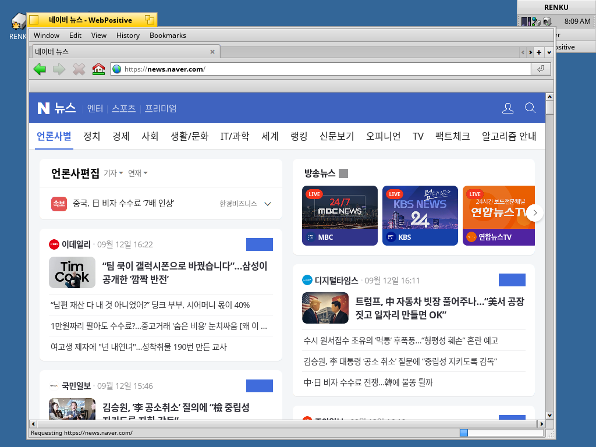
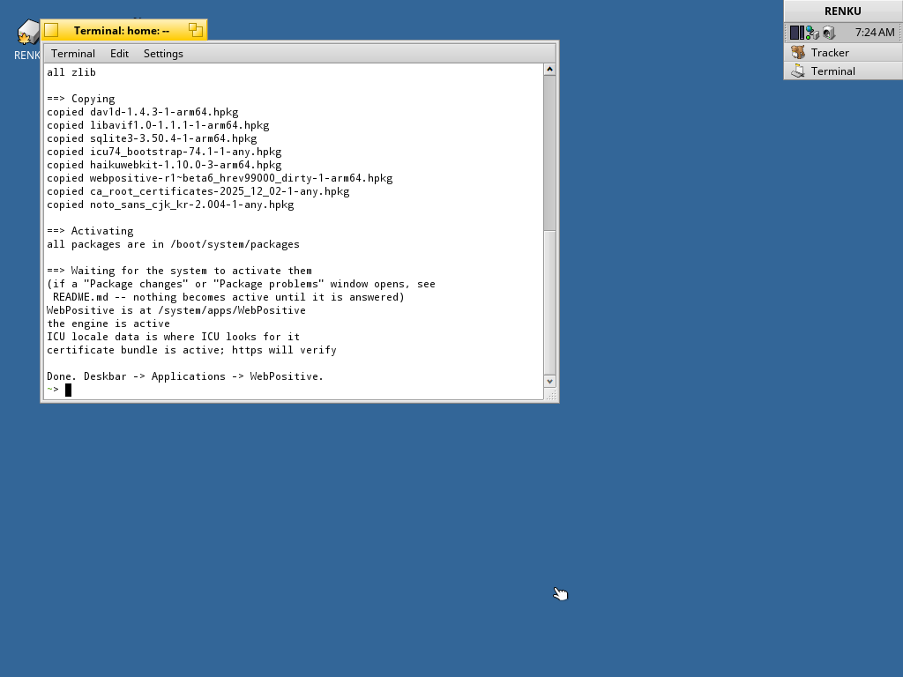
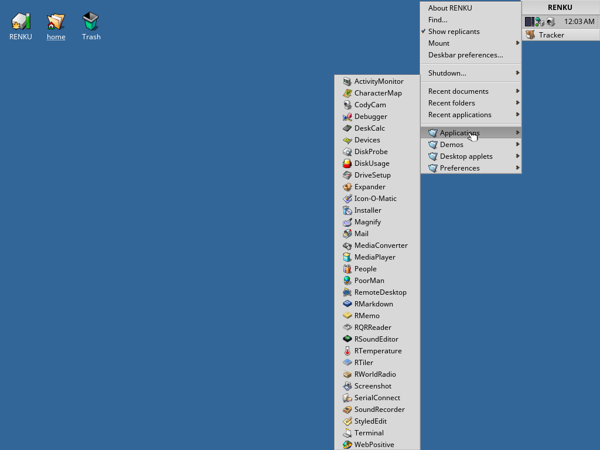
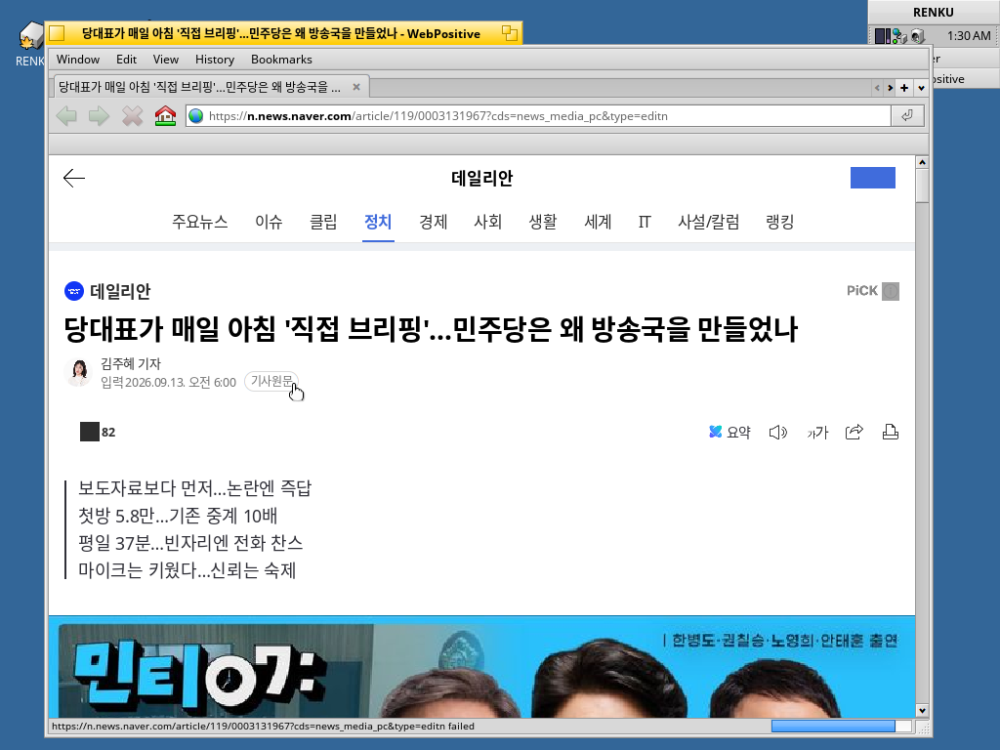
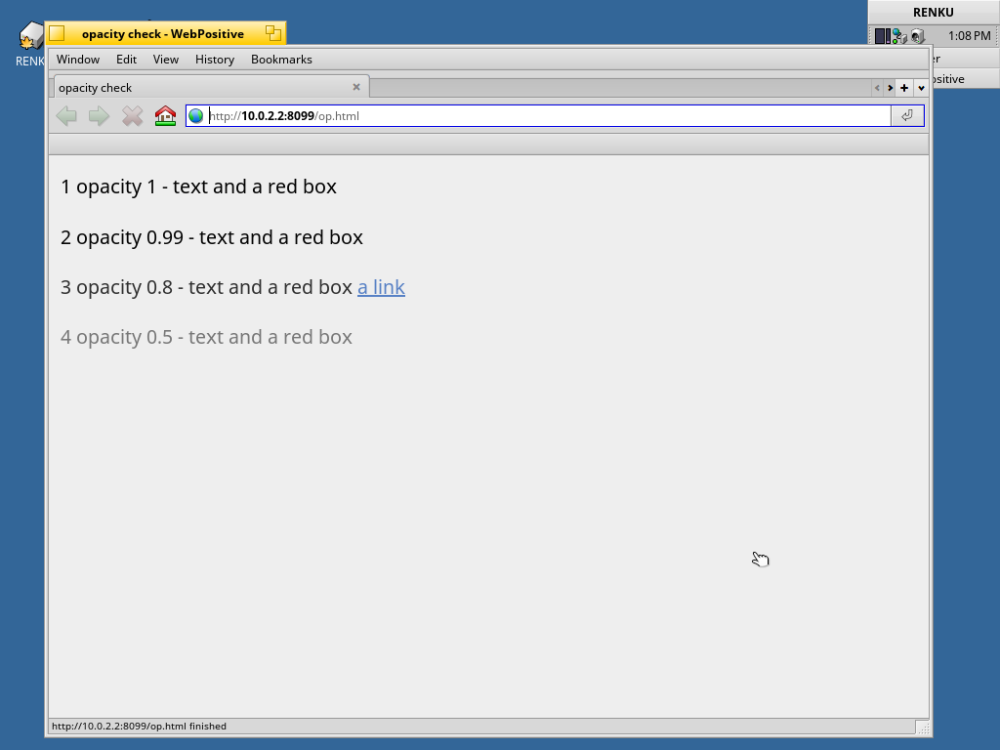
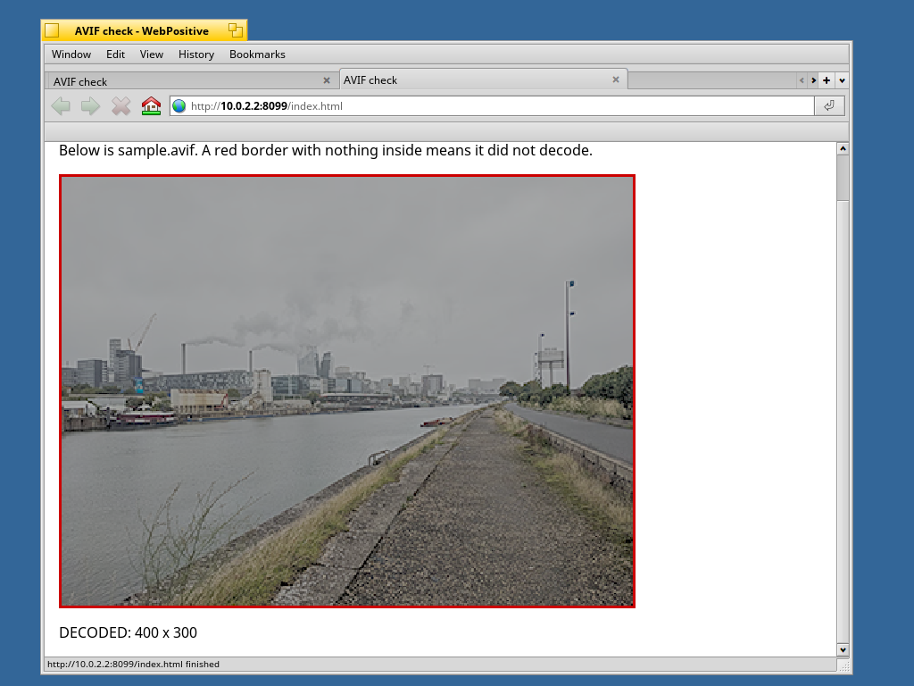
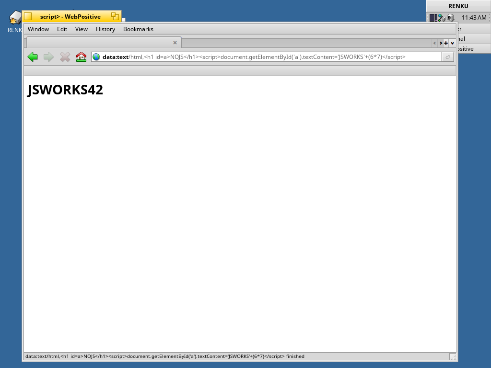
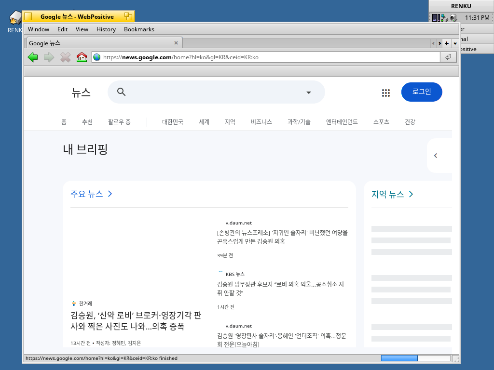
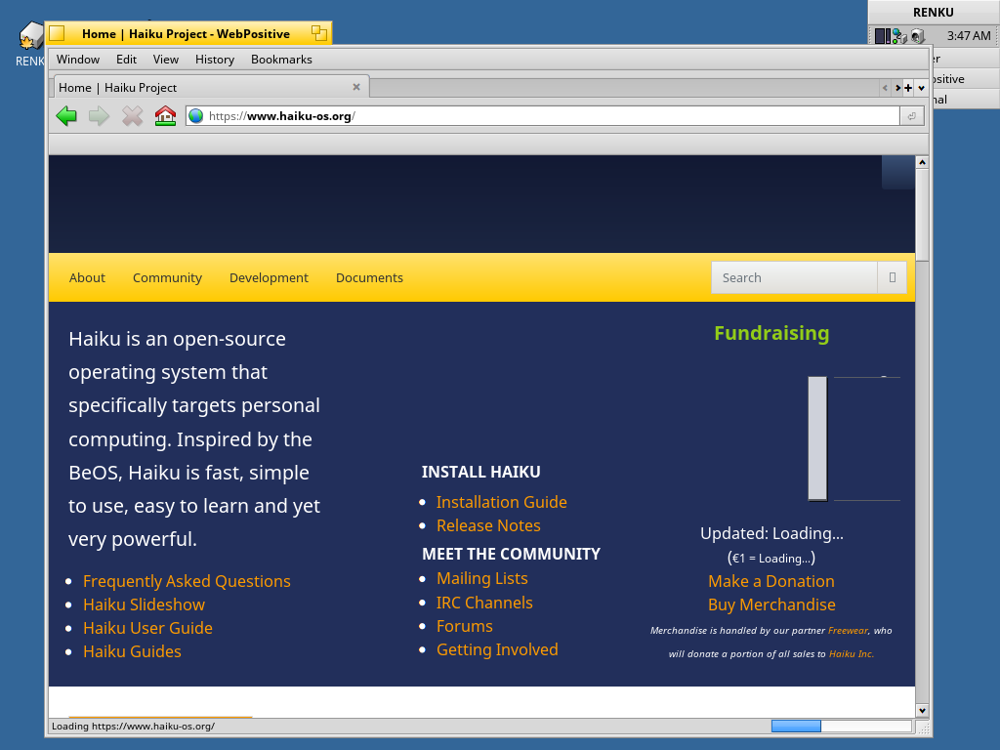
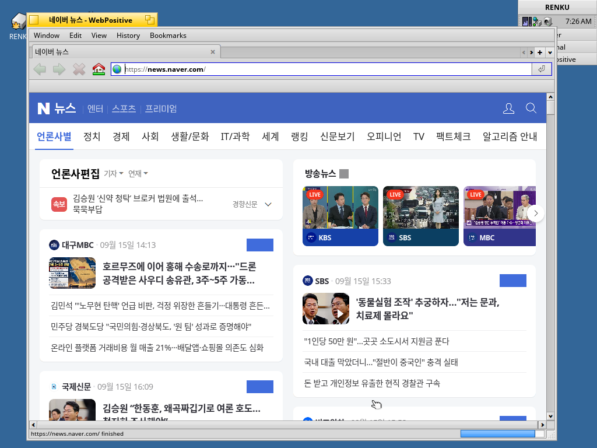

# Haiku arm64용 WebPositive

64비트 ARM에서 도는 Haiku에 웹 브라우저를 올린 것입니다. HaikuWebKit 1.10.0과
WebPositive를 arm64로 크로스 컴파일했습니다.

공식 Haiku arm64 이미지에는 브라우저가 없어서, 거기에 넣는 설치 스크립트가
여기 있습니다.

English version: [`README.md`](README.md).
포팅 과정과 측정값, 남은 문제: [`AGENTS.md`](AGENTS.md).



## Haiku arm64 이미지에 설치하기

Haiku가 내놓는 arm64 nightly(`haiku-master-hrevNNNNN-arm64-mmc.zip`,
[download.haiku-os.org](https://download.haiku-os.org/nightly-images/arm64/))에는
WebPositive가 없고, `pkgman install webpositive`로도 받을 수 없습니다. arm64
HaikuPorts 저장소는 비어 있고, Haiku가 arm64를 빌드하는 36개짜리 부트스트랩
패키지 묶음에는 WebKit이 없기 때문입니다. 브라우저와 그 아래 라이브러리를
손으로 복사해 넣어야 합니다.

`install-webpositive-arm64.sh`가 그 일을 합니다. 이 저장소의 `packages/`
디렉터리와 스크립트를 Haiku 기계로 옮기십시오. 실제 기계라면 USB 메모리로,
QEMU라면 ISO로 만들어 AHCI 컨트롤러의 CD-ROM으로 붙이는 것이 여기서 확실히
부팅되고 마운트되는 유일한 방법이었습니다:

```sh
hdiutil makehybrid -iso -joliet -o wpkg.iso <스크립트와 packages/가 든 폴더>
qemu-system-aarch64 ... \
  -device ahci,id=ahci \
  -drive file=wpkg.iso,if=none,id=d1,format=raw,media=cdrom,readonly=on \
  -device ide-cd,bus=ahci.0,drive=d1
```

그 다음 Haiku 기계에서 Terminal을 열어(볼륨이 바탕화면에 아직 없으면
`mountvolume -all` 먼저):

```sh
./install-webpositive-arm64.sh
```

아키텍처를 확인하고, 이미 설치된 것은 건너뛰고, 조용히 활성화되지 않을
패키지는 거부하고, 나머지를 `/boot/system/packages/`에 넣은 뒤, 브라우저가
실제로 나타났는지 확인합니다.

`-n`을 붙이면 아무것도 건드리지 않고 무엇을 할지만 보여줍니다.



그 다음 **Deskbar** -> **Applications** -> **WebPositive**. 메뉴에 아직 없으면
아래 "안 될 때"를 보십시오.

### 들어가는 것

패키지 열 개, 94 MB, 모두 `packages/`에 있습니다. 순정 arm64 이미지에는
패키지가 열한 개뿐이라 -- haiku, haiku_loader, haiku_datatranslators, bash,
coreutils, freetype, gcc_syslibs, icu 67, ncurses6, noto, zlib -- WebKit이
링크하는 것 거의 전부를 같이 가져가야 합니다:

| 패키지 | 크기 | 이유 |
|---|---|---|
| `haikuwebkit` | 37.0 MB | 엔진과, 같이 묶인 서드파티 라이브러리 |
| `webpositive` | 0.5 MB | 브라우저 |
| `icu74` | 14.3 MB | `libicuuc.so.74` 등. 이미지에는 ICU 67뿐 |
| `icu74_bootstrap` | 11.8 MB | ICU 로케일 데이터를 ICU가 찾는 자리에. **필수** |
| `openssl3` | 2.3 MB | `libssl.so.3`, `libcrypto.so.3` |
| `sqlite3` | 0.5 MB | 쿠키와 웹 스토리지 |
| `dav1d` | 0.4 MB | AV1 디코더 |
| `libavif1.0` | 0.1 MB | AVIF 이미지 |
| `ca_root_certificates` | 0.1 MB | https. 이미지에는 없음 |
| `noto_sans_cjk_kr` | 26.7 MB | 한글, 일본어, 중국어 글꼴. 선택 |

`icu74_bootstrap`은 `icu74` 옆에 있으면 중복처럼 보이지만 아닙니다. arm64의
`icu74`는 부트스트랩 빌드라 `libicudata`가 135 KB짜리 빈 껍데기이고,
`libicuuc`에는 데이터 디렉터리가
`/packages/icu74_bootstrap-74.1-1/.self/data/icu/74.1`로 박혀 있습니다. 정확히
그 이름과 버전의 패키지가 설치돼 있을 때만 존재하는 경로입니다. 없으면 ICU에
로케일 데이터가 없고, `ucal_openTimeZoneIDEnumeration`이 null을 돌려주고,
WebKit은 그걸 `ASSERT`로만 검사하니 JSC가 VM을 만들다 창이 뜨기도 전에
죽습니다.

### 안 될 때

- **"Package changes"나 "Package problems" 창이 떴다.** package_daemon이 추가된
  패키지의 의존성을 검사하고, 그 이상을 하기 전에 물어보는 것입니다. 답하기
  전까지는 아무것도 활성화되지 않습니다. "Package problems"에 `haikuwebkit`과
  `lib:libavif`가 보이면 패키지가 하나씩 들어간 것입니다(데몬은 마지막 파일
  뒤 0.5초 만에 움직입니다). 설치 스크립트는 전부 한꺼번에 이름을 바꿔 그걸
  피합니다. 손으로 복사했다면 취소하고 다음 항목을 보십시오.
- **Applications 메뉴에 없다.** 부팅 때 packagefs는 `/boot/system/packages/`의
  `.hpkg`를 전부 읽습니다. 단, 거기에 `administrative/activated-packages`가
  있으면 그 파일에 적힌 것만 읽습니다. 순정 이미지에는 그 파일이 없으니
  재부팅하면 전부 활성화됩니다. 파일이 있으면(package_daemon이 처음 변경을
  커밋할 때 만듭니다) 지우고 재부팅하십시오.
- **브라우저가 바로 꺼진다.** `icu74_bootstrap`이 활성화되지 않은 것입니다.
  `/packages/icu74_bootstrap-74.1-1/.self/data/icu/74.1/icudt74l.dat`가
  있는지 보십시오.
- **https가 안 된다.** `/system/data/ssl/CARootCertificates.pem`이 없습니다.
  `ca_root_certificates`가 활성화되지 않은 것입니다.
- **패키지가 `/boot/system/packages/`에 있는데 아무 일도 없다.** zstd로 압축된
  패키지이고 이 packagefs에 zstd가 없는 경우입니다. arm64에는 그걸 넣어 빌드할
  `zstd_devel`이 없어서 읽지 못하고, 아무 말도 하지 않습니다. 여기 있는
  패키지는 전부 zlib이고, 설치 스크립트는 아닌 것을 거부합니다. `.hpkg`의
  18-19번째 바이트가 zlib이면 `0001`, zstd면 `0002`입니다.

이 패키지들은 r1~beta6에 `AGENTS.md`의 패치를 더한 트리로 빌드했고, arm64
nightly는 master입니다. 순정 hrev59628 nightly는 이 맥의 QEMU에서 부팅되지
않아(hvf에서는 로더가 커널 진입에서 폴트, TCG에서는 업스트림 xhci 버그로
자기 디스크를 못 찾음) 설치 스크립트는 브라우저를 들어낸 arm64 Haiku 시스템에서
시험했지, 순정 nightly에서는 아닙니다. master와의 ABI가 여기서 검증되지 않은
유일한 부분입니다.

## Haiku arm64 이미지를 QEMU로 실행하기

Apple Silicon 맥이나 다른 arm64 기계, 그리고 EDK2 펌웨어가 딸린
`qemu-system-aarch64`(`brew install qemu`)가 필요합니다. 이미지가
`haiku-arm64.image`라면:

```sh
qemu-system-aarch64 \
  -M virt -cpu host -accel hvf -smp 4 -m 2048 \
  -bios /opt/homebrew/share/qemu/edk2-aarch64-code.fd \
  -device qemu-xhci,id=usb \
  -drive file=haiku-arm64.image,if=none,id=drv0,format=raw \
  -device usb-storage,bus=usb.0,drive=drv0 \
  -device usb-kbd,bus=usb.0 -device usb-tablet,bus=usb.0 \
  -netdev user,id=n0 -device virtio-net-pci,netdev=n0 \
  -device ramfb -display cocoa
```

데스크톱이 뜨기까지 1분쯤 기다리십시오.

실제 기계에서는 같은 파일을 USB 메모리나 SD 카드에 쓰고 거기서 부팅하면
됩니다.

```sh
sudo dd if=haiku-arm64.image of=/dev/rdiskN bs=4m
```

## 브라우저 실행

오른쪽 위 **Deskbar** -> **Applications** -> **WebPositive**.



## 되는 것

| | |
|---|---|
| 실제 사이트 | 한국 뉴스 포털, 기사 페이지, 링크 이동 |
| https | 시스템 인증서 묶음을 쓰는 TLS |
| JavaScript | baseline과 DFG JIT |
| 글자 | Noto Sans CJK로 한글, 일본어, 중국어 |
| 이미지 | PNG, JPEG, WebP, AVIF |
| CSS | `opacity` 포함. app_server 수정 두 개가 필요했습니다 |

2 GB 게스트에서 무거운 뉴스 포털을 완전히 읽어들이는 데 6~18초 걸립니다.
첫 화면이 뜨는 것은 1초 이내입니다. WebGL과 WebAssembly, FTL JIT 계층은
꺼져 있습니다.

## 스크린샷 더 보기

| | |
|---|---|
|  | 제목을 클릭해 들어간 네이버 뉴스 기사 |
|  | `opacity` 1, 0.99, 0.8, 0.5 |
|  | AVIF 이미지 디코딩 |
|  | JavaScript |
|  | 한글 렌더링 |
|  | https로 접속한 haiku-os.org |
|  | 브라우저가 없던 시스템에 설치 스크립트로 막 넣은 WebPositive에서 본 네이버 뉴스 |

이 프로그램은 Claude와 함께 작업해 만들었습니다. 이 저장소의 app_server 패치는
AI가 개입한 작업이며, Haiku 프로젝트는 그런 기여를 받지 않으므로 업스트림에
제출된 적이 없고 제출해서도 안 됩니다.
