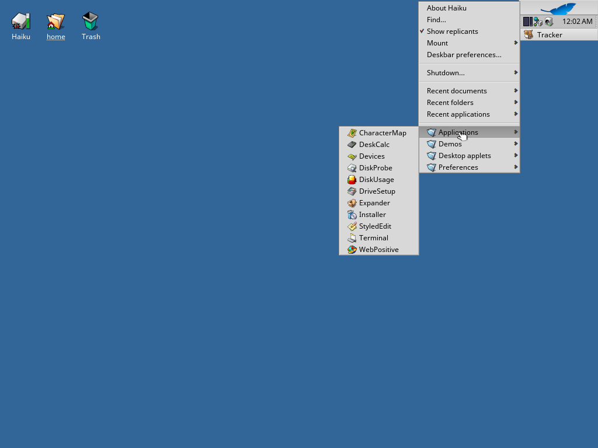

# WebPositive for Haiku arm64

A working web browser on Haiku running on 64-bit ARM. WebPositive with
HaikuWebKit 1.10.0, cross-compiled for arm64.

The official Haiku arm64 images do not ship a browser, so there is an
installer here that puts one on them.

Korean version: [`README.ko.md`](README.ko.md).
Porting notes, measurements and open problems: [`AGENTS.md`](AGENTS.md).


## Installing with pkgman

If the machine has a network connection, this is the simplest way -- but
two things about the image need checking first, because both cause
`pkgman add-repo` to fail with no useful-looking error. See `AGENTS.md`
for why each of these is necessary.

**1. Set the clock.** Every arm64 image this project has tested comes up
reading `Thu Jan 1 00:04:30 GMT 1970`, and no certificate on the real
internet is valid yet by that clock:

```sh
date -u MMDDhhmmYYYY    # example: date -u 0916120026 is Sep 16, 12:00, 2026 UTC
```

**2. Check whether this image's network kit has TLS at all -- most do
not.** Check by looking for `libssl.so.3`/`libcrypto.so.3` in
`readelf -d /system/lib/libbnetapi.so`. There is no way to fix this at
runtime; either use `http://` instead, or use an image built with
[`haiku-renku-arm64-ssltlspatch`](https://github.com/rainygirl/haiku-renku-arm64-ssltlspatch).

- **No TLS (the common case):** use the plain-HTTP mirror of this
  repository, and `webpositive`/`libmedia_bootstrap` come down over `http://`
  same as everything else on the box:

  ```sh
  yes | pkgman add-repo http://pkgman.rainygirl.com/arm64-webpositive
  pkgman install webpositive libmedia_bootstrap
  ```

  `yes |` matters for more than convenience: if a repository config with
  the same name is already there (from an earlier failed `https://`
  attempt, for instance) `add-repo` asks to overwrite it, and if stdin is
  already closed (a backgrounded/`nohup`'d run, for example) that prompt
  repeats forever instead of failing. Same reasoning applies to
  `pkgman install`, drop-repo, and any other pkgman command that might ask
  for confirmation.

- **This image does have TLS:** use `https://` and this repository
  directly, no mirror needed:

  ```sh
  pkgman add-repo https://raw.githubusercontent.com/rainygirl/haiku-rwebpositive-arm64/main
  pkgman install webpositive libmedia_bootstrap
  ```

Either way, `libmedia_bootstrap` has to be named explicitly -- see "What
gets installed" below for why it exists and why the dependency solver does
not pull it in on its own. If the image also has no `ca_root_certificates`
(a stock arm64 image does not), add that to the same `install` line.

**One command for everything**, R* apps included, on a machine that already
has a network connection:

```sh
curl -fsSL https://pkgman.rainygirl.com/install-all.sh | sh
```

This script sets the clock automatically and falls back from `https://` to
`http://` automatically, so it works on both kinds of image without asking.
A minimum image has no `curl` (or `wget`) to fetch it with in the first
place, though; `openssl s_client` is the one thing on the box that can
still talk to a server:

```sh
printf 'GET /install-all.sh HTTP/1.0\r\nHost: pkgman.rainygirl.com\r\n\r\n' \
	| openssl s_client -quiet -connect pkgman.rainygirl.com:443 \
		-servername pkgman.rainygirl.com 2>/dev/null > /tmp/i.raw
{ while IFS= read -r l; do [ "$l" = $'\r' ] && break; done; cat; } < /tmp/i.raw \
	> /tmp/install-all.sh
sh /tmp/install-all.sh
```

If the network is not available at all, use one of the two offline methods
below instead; neither needs the guest to reach anything.

## Installing offline, without pkgman

Haiku's own arm64 nightlies (`haiku-master-hrevNNNNN-arm64-mmc.zip` from
[download.haiku-os.org](https://download.haiku-os.org/nightly-images/arm64/))
have no WebPositive, and the arm64 HaikuPorts repository is empty, and the
36-package bootstrap set Haiku builds arm64 from carries no WebKit -- so
short of pointing `pkgman` at this repository (above), the browser and its
libraries have to be copied in by hand.

That is what `install-webpositive-arm64.sh` does. Copy this repository's
`packages/` directory and the script onto the Haiku machine -- on real
hardware, a USB stick; in QEMU, an ISO attached as a CD-ROM on an AHCI
controller, which is the one carrier that reliably boots and mounts here:

```sh
hdiutil makehybrid -iso -joliet -o wpkg.iso <folder with the script and packages/>
qemu-system-aarch64 ... \
  -device ahci,id=ahci \
  -drive file=wpkg.iso,if=none,id=d1,format=raw,media=cdrom,readonly=on \
  -device ide-cd,bus=ahci.0,drive=d1
```

Then, in a Terminal on the Haiku machine (`mountvolume -all` first, if the
volume is not on the desktop yet):

```sh
./install-webpositive-arm64.sh
```

It checks the architecture, skips anything already installed, refuses any
package that would silently fail to activate, copies the rest into
`/boot/system/packages/`, and then checks that the browser actually appeared.

Use `-n` to see what it would do without touching anything, and `-u` to
remove everything it installed.


Then **Deskbar** -> **Applications** -> **WebPositive**. If the entry is not
there yet, see "If it does not work" below.

### What gets installed

94 MB in eleven packages, all in `packages/`. A stock arm64 image carries
eleven packages of its own -- haiku, haiku_loader, haiku_datatranslators,
bash, coreutils, freetype, gcc_syslibs, icu74 or icu 67 depending on the
build, ncurses6, noto, zlib -- so nearly everything WebKit links against has
to come along:

| Package | Size | Why |
|---|---|---|
| `haikuwebkit` | 37.0 MB | The engine, with the third-party libraries it bundles |
| `webpositive` | 0.5 MB | The browser |
| `icu74` | 14.3 MB | `libicuuc.so.74` and friends; some images have only ICU 67 |
| `icu74_bootstrap` | 11.8 MB | ICU's locale data, where ICU looks for it. **Required** |
| `libmedia_bootstrap` | 0.3 MB | `libmedia.so`, or WebPositive will not start. **Required** |
| `openssl3` | 2.3 MB | `libssl.so.3`, `libcrypto.so.3` |
| `sqlite3` | 0.5 MB | Cookies and web storage |
| `dav1d` | 0.4 MB | AV1 decoder |
| `libavif1.0` | 0.1 MB | AVIF images |
| `ca_root_certificates` | 0.1 MB | https; the image has none |
| `noto_sans_cjk_kr` | 26.7 MB | Korean, Japanese and Chinese glyphs. Optional |

`icu74_bootstrap` looks redundant next to `icu74`, and is not. The arm64
`icu74` is a bootstrap build: its `libicudata` is a 135 KB stub, and
`libicuuc` has its data directory compiled in as
`/packages/icu74_bootstrap-74.1-1/.self/data/icu/74.1` -- a path that only
exists if a package of exactly that name and version is installed. Without it
ICU has no locale data, `ucal_openTimeZoneIDEnumeration` returns null, WebKit
checks that only with an `ASSERT`, and JSC crashes constructing its VM before
any window appears.

`libmedia_bootstrap` exists because every arm64 nightly this project has
found -- both the ones built here and the ones at download.haiku-os.org --
turns out to be built from the *minimum* image profile, which drops the
whole Media Kit: no media_server, no libmedia.so, on any architecture, by
design. HaikuWebKit links libmedia.so unconditionally, so without it
WebPositive does not open a window at all; it exits with
`runtime_loader: Cannot open file libmedia.so`. This package is that one
file, pulled from a full build of the same Haiku revision, with nothing else
needed since its own dependencies (`libbe`, `libroot`, `libstdc++`,
`libgcc_s`) are already part of every Haiku system. If your image already
has a full Media Kit (a "regular"/desktop build, not minimum), leave this
one out -- see `inject-webpositive-arm64.sh` below for how, and why
installing it anyway would be a problem, not just a waste.

### If it does not work

- **A "Package changes" or "Package problems" window opened.** package_daemon
  runs a dependency check on what was added and asks before doing anything
  beyond that. Nothing is active until it is answered. "Package problems"
  naming `haikuwebkit` and `lib:libavif` means the packages arrived one by one
  (the daemon acts half a second after the last file) -- the installer avoids
  that by renaming them all at once; if you copied by hand, cancel, and see
  the next point.
- **Nothing in the Applications menu.** At boot, packagefs loads every
  `.hpkg` in `/boot/system/packages/` -- unless
  `administrative/activated-packages` exists there, in which case it loads
  exactly the set that file names. Stock images have no such file, so a
  reboot activates everything. If the file exists (package_daemon writes it
  the first time it commits a change), remove it and reboot.
- **The browser exits immediately.** Two different packages can cause this,
  and the error on the way out (in a Terminal, or the crash log under
  `/boot/system/var/log/`) says which:
    - `runtime_loader: Cannot open file libmedia.so` -- `libmedia_bootstrap`
      did not activate. Check `/system/lib/libmedia.so`.
    - Nothing prints, the window just never appears -- `icu74_bootstrap` did
      not activate. Check
      `/packages/icu74_bootstrap-74.1-1/.self/data/icu/74.1/icudt74l.dat`.
- **https fails.** `/system/data/ssl/CARootCertificates.pem` is missing, so
  `ca_root_certificates` did not activate.
- **A package sits in `/boot/system/packages/` doing nothing.** It is
  zstd-compressed and this packagefs has no zstd -- arm64 has no `zstd_devel`
  to build it with, so it cannot read those, and says nothing about it. Every
  package shipped here is zlib, and the installer refuses anything that is
  not. Bytes 18-19 of an `.hpkg` are `0001` for zlib, `0002` for zstd.

These packages are built against r1~beta6 plus the patches in `AGENTS.md`;
the arm64 nightlies are master. The stock hrev59628 nightly does not boot in
QEMU on this Mac (under hvf the loader faults at kernel entry; under TCG the
upstream xhci bug stops it finding its own disk), so the installer was tested
on an arm64 Haiku system with the browser stack removed, not on a stock
nightly. The
ABI against master is the one thing here that has not been verified.

## Installing without booting Haiku at all

`install-webpositive-arm64.sh` needs the target Haiku to actually boot, with
somewhere to attach the install media. That does not always hold: this
port's xhci does not notice a USB disk plugged in after the machine is
already running, and its AHCI controller refuses a hot-plugged device
outright (both tested against a live QEMU instance), so a running machine
whose devices cannot be changed offers no way in short of a reboot -- which
is fine on hardware you control, but not if you would rather not boot the
target at all, or cannot attach anything to it while it is running.

`inject-webpositive-arm64.sh` is the alternative: it writes the packages
straight into a raw disk image's boot partition from the host side, using
the same host tools (`bfs_shell`, `fs_shell_command`) Haiku's own build
system uses to populate a fresh image, without Haiku ever running. It has
been verified to produce a disk that boots straight to a working
WebPositive with no boot cycle in between:

```sh
export BFS_SHELL=/path/to/generated.arm64/objects/linux/arm64/release/tools/bfs_shell/bfs_shell
export FS_SHELL_COMMAND=/path/to/generated.arm64/objects/linux/arm64/release/tools/fs_shell/fs_shell_command
./inject-webpositive-arm64.sh haiku-arm64.image
```



Both tools are host-tool build products of a Haiku source tree, not
something to install separately -- see `AGENTS.md` for where this project's
own copies come from, and pass `-m` to skip `libmedia_bootstrap` if the
target already has a full Media Kit (see above).

## Running a Haiku arm64 image in QEMU

You need an Apple Silicon Mac or another arm64 machine, and
`qemu-system-aarch64` with EDK2 firmware (`brew install qemu`). With the
image in `haiku-arm64.image`:

```sh
qemu-system-aarch64 \
  -M virt -cpu host -accel hvf -smp 4 -m 2048 \
  -bios /opt/homebrew/share/qemu/edk2-aarch64-code.fd \
  -device qemu-xhci,id=usb \
  -drive file=haiku-arm64.image,if=none,id=drv0,format=raw \
  -device usb-storage,bus=usb.0,drive=drv0 \
  -device usb-kbd,bus=usb.0 -device usb-tablet,bus=usb.0 \
  -netdev user,id=n0 -device virtio-net-pci,netdev=n0 \
  -device ramfb -display cocoa
```

Give it about a minute for the desktop.

On real hardware, write the same file to a USB stick or SD card and boot
from it:

```sh
sudo dd if=haiku-arm64.image of=/dev/rdiskN bs=4m
```

## Starting the browser

**Deskbar** (top right) -> **Applications** -> **WebPositive**.


## What works

| | |
|---|---|
| Real sites | Korean news portals, article pages, link navigation |
| https | TLS with the system certificate bundle |
| JavaScript | Baseline and DFG JIT |
| Text | Korean, Japanese and Chinese, with Noto Sans CJK |
| Images | PNG, JPEG, WebP, AVIF |
| CSS | Including `opacity`, which needed two app_server fixes |

Full page loads of a heavy news portal take 6 to 18 seconds in a 2 GB guest;
the first paint is under a second. WebGL, WebAssembly and the FTL JIT tier
are off.

## More screenshots

| | |
|---|---|
|  | A Naver News article, reached by clicking a headline |
|  | `opacity` 1, 0.99, 0.8 and 0.5 |
|  | An AVIF image decoding |
|  | JavaScript |
|  | Korean text rendering |
|  | haiku-os.org over https |
|  | Naver News, in a WebPositive the installer had just put onto a system that had none |

This program was written with Claude. The app_server patch in this
repository is AI-assisted work; the Haiku project does not accept such
contributions, and it has not been and should not be submitted upstream.
